# 🧙 Devoxx4Kids — Dungeon du Sorcier

🇫🇷 Français | [🇬🇧 English](README.en.md)

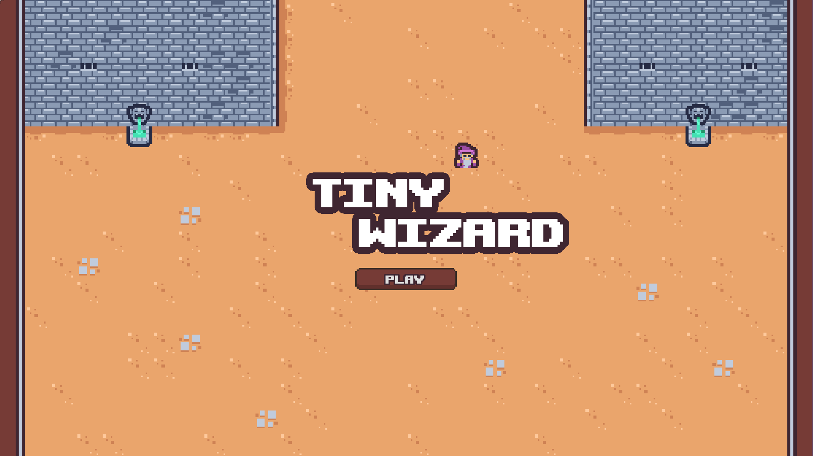

Bienvenue à l'atelier **Programmation de Jeux Vidéo** de [Devoxx4Kids Québec](https://www.devoxx4kids.org/quebec) !

Tu vas explorer un vrai jeu vidéo, comprendre comment il fonctionne, et l'améliorer toi-même.
À la fin de la session, tu pourras le présenter à tes parents !

---

## 📚 Avant de commencer

### 🕹️ Les moteurs de jeu dans l'industrie

Pour créer un jeu vidéo, les développeurs utilisent des **moteurs de jeu** : des outils qui s'occupent des choses compliquées (afficher les graphismes, gérer la physique, lire les sons…) pour que toi tu puisses te concentrer sur ce qui rend ton jeu unique.

Il en existe plusieurs, chacun avec ses forces. Voici les plus connus :

| Moteur                                            | Utilisé pour                                             | Pourquoi on le choisit                                                                                                  |
| ------------------------------------------------- | -------------------------------------------------------- | ----------------------------------------------------------------------------------------------------------------------- |
| [**Unity**](https://unity.com)                    | Hollow Knight, Cuphead, Among Us                         | Très populaire, énorme communauté, compatible avec presque toutes les plateformes. Idéal pour les studios indépendants. |
| [**Unreal Engine**](https://www.unrealengine.com) | Fortnite, Valorant, Hogwarts Legacy                      | Graphismes ultra-réalistes. Utilisé par les grands studios AAA (gros budgets).                                          |
| [**Godot**](https://godotengine.org)              | Slay the Spire 2, Cassette Beasts, Sonic Colors Ultimate | Gratuit, Open Source, léger, facile à apprendre. Parfait pour débuter et pour les jeux indépendants.                    |
| [**GameMaker**](https://gamemaker.io)             | Undertale, Hotline Miami, Stardew Valley                 | Simple à prendre en main, très apprécié pour les jeux 2D.                                                               |
| [**RPG Maker**](https://www.rpgmakerweb.com)      | Omori, Yume Nikki                                        | Spécialisé dans les RPG (jeux de rôle). Peu ou pas de programmation requise.                                            |

> 💡 **Lequel choisir ?** Ça dépend du projet ! Pour débuter, **Godot** et **GameMaker** sont excellents. Pour viser les gros jeux 3D professionnels, on se tourne plutôt vers **Unreal**. Dans cet atelier, on utilise **Godot** — il est gratuit, Open Source, et sa prise en main est rapide.

---

### 🌍 Ok, mais c'est quoi l'Open Source ?

Un logiciel **Open Source** (ou « code ouvert ») est un programme dont le **code source est public** : n'importe qui peut le lire, l'utiliser, le modifier et le partager.

C'est un peu comme si une recette de cuisine était écrite dans un livre ouvert à tous, au lieu d'être gardée secrète. Tu peux copier la recette, l'améliorer, et même la redistribuer !

Ce jeu est Open Source. Le moteur de jeu utilisé, **Godot**, l'est aussi. Même ce fichier README que tu lis est public ! 🎉

> **Exemples célèbres d'Open Source :** Linux (le système d'exploitation de millions de serveurs), Firefox (le navigateur), Blender (logiciel 3D), et… Godot !

### 🎮 Découvrons Godot !

[**Godot Engine**](https://godotengine.org/) est un **moteur de jeu vidéo** gratuit et Open Source. Un moteur de jeu, c'est un outil qui te fournit tout ce dont tu as besoin pour créer un jeu : afficher des images, jouer des sons, détecter les collisions, gérer les entrées du clavier, etc.

Il est utilisé par des milliers de développeurs dans le monde, des amateurs comme des professionnels.

- 📖 [Documentation officielle de Godot](https://docs.godotengine.org/fr/stable/)

### Comment fonctionne Godot ?

Godot est organisé autour de deux concepts clés : les **Scènes** et les **Scripts**.

**Les Scènes** sont les blocs de construction du jeu. Chaque personnage, chaque bouton de menu, chaque niveau est une scène. Une scène contient des **nœuds** (_nodes_) — des petites briques qu'on assemble : un nœud pour l'image, un pour le son, un pour la collision, etc.

**Les Scripts** sont les fichiers de code qu'on attache aux nœuds pour leur donner un comportement. C'est là qu'on écrit en GDScript (ou C#) pour dire à un personnage comment bouger, quand tirer, comment mourir…

L'interface de Godot se divise en 4 grandes zones :

```
┌────────────────────────────────────────────────┐
│  Barre d'outils (Play ▶, Save, etc.)           │
├───────────┬────────────────────┬───────────────┤
│           │                    │               │
│ Scene     |   Viewport         │   Inspector   │
│ (arbre    │   (ce que tu vois  │   (propriétés │
│  de nœuds)│    dans le jeu)    │    du nœud)   │
│           │                    │               │
├───────────┤                    ├───────────────┤
│ FileSystem│                    │               │
│ (tes      │                    │               │
│  fichiers)│                    │               │
├───────────┴────────────────────┴───────────────┤
│  Output / Console (messages d'erreur, print…)  │
└────────────────────────────────────────────────┘
```

- 📖 [Découvrir l'interface de Godot](https://docs.godotengine.org/fr/4.x/getting_started/introduction/first_look_at_the_editor.html)

### Les langages de programmation les plus connus

Un **langage de programmation** est une façon d'écrire des instructions que l'ordinateur peut comprendre. Il en existe des dizaines — chacun a été créé pour répondre à un besoin particulier.

| Langage        | Utilisé pour                                    | Ce qui le caractérise                                                           |
| -------------- | ----------------------------------------------- | ------------------------------------------------------------------------------- |
| **Python**     | Science des données, IA, scripts, éducation     | Très lisible, idéal pour apprendre. Beaucoup utilisé dans les écoles.           |
| **JavaScript** | Sites web, applications web                     | Tourne dans le navigateur. Incontournable pour tout ce qui est web.             |
| **C#**         | Jeux Unity, applications Windows, web (ASP.NET) | Puissant et structuré. Proche du C++ mais plus accessible.                      |
| **C++**        | Jeux AAA, systèmes, moteurs de jeu              | Très rapide. Difficile à apprendre, mais utilisé dans les moteurs comme Unreal. |
| **Java**       | Applications Android, logiciels d'entreprise    | Populaire dans les grandes entreprises et les applis mobiles Android.           |
| **GDScript**   | Jeux Godot                                      | Créé spécialement pour Godot. Inspiré de Python. Facile à prendre en main.      |
| **Rust**       | Systèmes, outils performants                    | Moderne, très sûr, de plus en plus populaire.                                   |
| **Swift**      | Applications iPhone / iPad / Mac                | Langage d'Apple pour tout l'écosystème iOS/macOS.                               |

> 💡 **Pas besoin de tous les apprendre !** Les développeurs choisissent leur langage selon ce qu'ils veulent créer. Dans cet atelier, tu vas utiliser **GDScript** — et beaucoup de ce que tu vas apprendre s'applique aussi à Python !

### 📝 GDScript ?

**GDScript** est le langage de programmation principal de Godot. Il ressemble beaucoup à **Python** : il est facile à lire et à écrire, parfait pour les débutants !

Voici un exemple de GDScript :

```gdscript
# Ceci est un commentaire (il n'est pas exécuté)
var vitesse = 200          # On crée une variable "vitesse"

## S'exécute une fois au démarrage de la scène
func _ready():
	print("Le jeu démarre !")  # Affiche un message au démarrage

## S'exécute à chaque image (60x/sec)
func _process(delta):
	position.x += vitesse * delta  # Déplace l'objet vers la droite
```

- 📖 [Introduction à GDScript](https://docs.godotengine.org/fr/stable/tutorials/scripting/gdscript/gdscript_basics.html)

---

## 💾 Sauvegarder ton projet

Tu peux sauvegarder ton projet à tout moment grâce aux scripts de sauvegarde inclus dans le dossier du jeu.

### Sur Windows — double-clique sur `save.bat`

Le fichier se trouve ici :

```
C:\workspace\atelier-jeu-video\save.bat
```

> Il y a aussi `save.sh` à utiliser sur Linux

Double-clique dessus.

Le fichier se trouve dans le dossier du jeu. Double-clique dessus et choisis **"Exécuter"** (ou "Run in Terminal") si une fenêtre te le demande. Une fenêtre noire s'ouvre avec le Dungeon Save System 🧙. Il te demande deux choses :

1. **Un nom de sauvegarde** (20 caractères max) — par exemple ton prénom, ou `"avant-laser"`, `"version-finale"`…
2. **GIT ou ZIP** — choisis ta méthode :

| Méthode | Quand l'utiliser                                                                                                                                     |
| ------- | ---------------------------------------------------------------------------------------------------------------------------------------------------- |
| **ZIP** | Dans tous les cas — crée un fichier `<nom>.zip` dans le dossier du jeu. C'est la méthode recommandée pour tout le monde.                             |
| **GIT** | Pendant le workshop uniquement, si toi ou quelqu'un dans ton entourage sait utiliser Git. Ça enregistre une version dans l'historique Git du projet. |

> 💡 **Tu ne sais pas ce qu'est Git ?** Choisis **ZIP** — c'est simple, rapide, et ça marche toujours !

---

## Étapes de l'atelier

Suis ces étapes ci dessous dans l'ordre. Demande à un animateur si tu es bloqué !

1. [x] **Installe Godot** - si ce n'est pas déjà fait - en suivant les instructions plus bas dans la section [Installation à la maison](#installation-à-la-maison)
2. [ ] **[Découvre le jeu](#aperçu-du-jeu)** - 🎮 dans Godot, découvre le jeu et joue quelques minutes pour le comprendre
3. [ ] **[Ouvre le projet](#jouons)** - 🎮 dans Godot, découvre le jeu et joue quelques minutes pour le comprendre
4. [ ] **[Explore le projet](#structure-de-fichiers)** : - 📂 découvre les fichiers, les dossiers, les scènes, les scripts
5. [ ] **[Apprends les bases du code](#les-bases-du-code)** 📖 pour être prêt à comprendre, modifier et programmer le jeu
6. [ ] **[Complète tes défis](#tes-défis)** ⚔️ Complète toutes les étapes des défis ci-dessous
   - [ ] **[Groupe de défis 1](#groupe---explorateur)** - 🔍 (pas-de-code-requis)
   - [ ] **[Groupe de défis 2](#groupe---bidouilleur-de-ressources)** - ⚙️ Bidouilleur de Ressources
   - [ ] **[Groupe de défis 3](#groupe---lecteur-de-code)** - 📖 Lecteur de Code - Comprendre les scripts
   - [ ] **[Groupe de défis 4](#groupe---codeur)** - 💻 Codeur - Écris du code !
   - [ ] **[Groupe de défis 5](#groupe---score)** - 🔢 Perfectionniste - Ajoutes un score
   - [ ] **[Groupe de défis 6](#groupe---une-vague-de-plus)** - 🌊 Créer ta propre vague d'ennemis
   - [ ] **[Groupe de défis 7](#groupe---artiste-pixel-art)** - 🎨 Artiste Pixel Art - Personnalise ton personnage
   - [ ] **[Groupe de défis 8](#groupe---architecte)** - 🏗️ Architecte - Ajoute des Obstacles
   - [ ] **[Groupe de défis 9](#groupe---codeur-créatif)** - 🎮 Codeur Créatif - Personnalise avec du code
   - [ ] **[Groupe de défis 11](#groupe---ajoutes-une-nouvelle-arme-rayon-laser)** - ⚡ Ajoutes une nouvelle arme rayon laser
   - [ ] **[Groupe de défis 12](#groupe---téléportation)** - 🌀 Téléportation
   - [ ] **[Groupe de défis 13](#groupe---tempête-électrique)** - ⛈️ Tempête Électrique

7. [ ] **[Upload ton projet](#upload-ton-projet)** - ⬆️ avant de partir dans notre [dossier Google Drive](https://drive.google.com/drive/folders/1Nno74QtZJMh8ZiMtmIGogpXdfisY1pnj?usp=sharing) pour le retrouver chez toi
8. [ ] **[Présente ton jeu !](#présente-ton-jeu)** - 🏁 à tes parents à la fin de la session !

---

## Aperçu du jeu

[Revenir aux étapes ⬆️](#étapes-de-latelier)

### Le jeu

C'est un jeu d'aventure en vue du dessus dans un donjon. Tu joues un **sorcier** qui doit survivre à des **vagues d'ennemis** en tirant des boules de feu. Ramasse des **potions** pour améliorer tes statistiques entre les vagues !

### Les ennemis

| Ennemi           | Comportement                            |
| ---------------- | --------------------------------------- |
| 🦇 Chauve-souris | Fonce droit vers toi                    |
| 👻 Fantôme       | Fonce droit vers toi                    |
| 🕷️ Araignée      | Se balance en se déplaçant              |
| 🏹 Archer        | Garde ses distances et tire des flèches |
| ⚔️ Chevalier     | Fonce droit vers toi, très résistant    |

### Les potions

| Potion               | Effet                                                        |
| -------------------- | ------------------------------------------------------------ |
| ❤️ Potion de vie     | Restaure des points de vie et augmente les points de vie max |
| 💨 Potion de vitesse | Augmente ta vitesse de déplacement                           |
| ⚔️ Potion de dégâts  | Augmente les dégâts de tes boules de feu                     |
| 🌀 Potion de cadence | Réduit le temps entre chaque tir                             |

### Détails techniques

- **Moteur** : [Godot Engine 4](https://godotengine.org/)
- **Langage** : GDScript
- **Type** : Top-down dungeon, survie par vagues

---

## Jouons

[Revenir aux étapes ⬆️](#étapes-de-latelier)

Un bon jeu vidéo est un jeu vidéo qui est fun. Comment savoir si un jeu est fun ? Pas le choix, il faut y jouer 🎮 !

### Ouvrir le projet dans Godot

Si le projet n'est pas déjà ouvert sur les ordinateurs:

1. Lance **Godot Engine**
2. Dans le **Project Manager**, clique sur **Import**
3. Navigue jusqu'au dossier du projet et sélectionne le fichier `project.godot`
4. Clique sur **Import & Edit**
5. Appuie sur **F5** (ou le bouton ▶ en haut à droite) pour lancer le jeu

### Comment jouer

#### Clavier + Souris _(recommandé)_

| Action      | Touche          |
| ----------- | --------------- |
| Se déplacer | `W` `A` `S` `D` |
| Attaquer    | Clic gauche 🖱️  |
| Pause       | `Échap`         |

> ⚠️ **Attention :** Pour l'instant, la visée avec la souris ne fonctionne pas encore — le sorcier tire toujours vers la droite ! **C'est l'un de tes défis de le corriger.** 🎯

#### Manette (gamepad)

| Action      | Bouton               |
| ----------- | -------------------- |
| Se déplacer | Joystick gauche      |
| Viser       | Joystick droit       |
| Attaquer    | Gâchette droite (RT) |
| Pause       | Start                |

---

## Comment le rendre encore plus fun ?

Le jeu n'est pas parfait, il manque des choses ? C'est ce que tu vas apprendre à faire. Commence par comprendre comment le jeu est organisé.

## Structure de fichiers

[Revenir aux étapes ⬆️](#étapes-de-latelier)

```
atelier-jeu-video/
├── assets/          	🎨 Images, sons, musiques
├── resources/       	⚙️ Fichiers de configuration (stats, vagues...)
│   ├── enemy_stats/    📊 Stats de chaque ennemi (vie, vitesse, dégâts)
│   ├── player_stats/   📊 Stats du joueur
│   └── wave_data/      🌊 Configuration des vagues d'ennemis
└── src/             	💻 Le code et les scènes du jeu
	├── scenes/         🎬 Scènes Godot (personnages, UI, monde...)
	│   ├── entities/   🧙 Joueur et ennemis
	│   ├── game/       🧠 Logique principale du jeu (vagues, spawn...)
	│   ├── items/      🍶 Les potions ramassables
	│   └── ui/         🪟 Interface (menus, HUD, écran de mort)
	└── scripts/        📜 Scripts GDScript réutilisables
		├── autoloads/  📜 Scripts accessibles partout dans le jeu
		└── resources/  📜 Définitions des types de ressources
```

### Les types de fichiers à connaître et leur localisation dans le FileSystem

```
atelier-jeu-video/
├── assets/          	🎨 Fichiers .png, .jpg, .ttf, .wav, .mp3
├── resources/       	⚙️ Fichiers .tres
└── src/             	💻 Le code et les scènes du jeu
	├── scenes/         🎬 Fichiers .tscn, .gd
	└── scripts/        📜 Fichiers .gd
```

---

### Les fichiers clés à connaître

| Fichier                                                  | Ce qu'il fait                                 |
| -------------------------------------------------------- | --------------------------------------------- |
| `resources/player_stats/player_stats.tres`               | Les stats du joueur (vie, vitesse, dégâts...) |
| `resources/enemy_stats/bat_stats.tres`                   | Les stats d'une chauve-souris                 |
| `resources/wave_data/wave1_data.tres`                    | La configuration de la vague 1                |
| `src/scenes/entities/player/movement/player_movement.gd` | Le déplacement du joueur                      |
| `src/scenes/entities/player/weapon/weapon.gd`            | L'arme et la visée                            |
| `src/scenes/entities/player/fireball/fireball.gd`        | La boule de feu                               |
| `src/scripts/autoloads/game_data.gd`                     | Données globales du jeu                       |
| `src/scripts/autoloads/signals.gd`                       | Les signaux (événements) du jeu               |

## Les bases du code

[Revenir aux étapes ⬆️](#étapes-de-latelier)

Avant de commencer les défis, voici les trois briques essentielles du code que tu vas rencontrer. Pas besoin de tout mémoriser — reviens ici si tu bloques !

---

### 📦 Les variables — stocker une information

Une **variable**, c'est une boîte avec un nom, dans laquelle tu ranges une valeur. Tu peux lire cette valeur ou la changer à tout moment.

```gdscript
var speed: int = 200        # une boîte "speed" qui contient le nombre 200
var name: String = "Merlin" # une boîte "name" qui contient du texte
```

Dans le jeu, `player_stats.speed` est une variable qui contient la vitesse du sorcier.
Si tu changes sa valeur, le sorcier va plus vite ou plus lentement.

**Le type** (`int`, `String`...) indique ce que la boîte peut contenir : un nombre entier, du texte, etc.
Tu verras aussi `float` pour les nombres à virgule (ex: `0.5`).

---

### ❓ Le if / else — prendre une décision

Le **if** permet au code de choisir quoi faire selon une condition.
S'il la condition est vraie, le bloc du `if` s'exécute. Sinon, c'est le bloc du `else`.

```gdscript
if points > 10: # si points dépasse 10
	print("Tu as gagné !") # affiche le message de victoire
else: # sinon
	print("Pas encore...") # affiche le message d'échec
```

Dans le jeu, on utilise `if / else` pour viser avec le joystick OU avec la souris selon ce que le joueur utilise :

```gdscript
if right_stick_direction != Vector2.ZERO:
	current_direction = right_stick_direction  # joystick détecté → on l'utilise
else:
	current_direction = ...                    # sinon → on vise avec la souris
```

---

### 🔧 Les fonctions — regrouper du code

Une **fonction**, c'est un bloc de code qui a un nom et qu'on peut appeler quand on en a besoin.
Ça évite de répéter le même code partout.

```gdscript
## Affiche un message de bienvenue
func dire_bonjour() -> void:
	print("Bonjour !") # affiche le texte à la console

dire_bonjour()  # appelle la fonction → affiche "Bonjour !"
```

Dans Godot, certaines fonctions sont appelées automatiquement par le moteur :

- `_ready()` — s'exécute **une fois** au démarrage de la scène
- `_process(delta)` — s'exécute **à chaque image** (60 fois par seconde)

Tu les verras souvent dans le code du jeu !

---

## Tes défis

[Revenir aux étapes ⬆️](#étapes-de-latelier)

Les défis sont regroupés par niveau de difficulté. **Commence par le groupe 1** et avance à ton rythme !

---

### Groupe - Explorateur

[Revenir aux étapes ⬆️](#étapes-de-latelier)

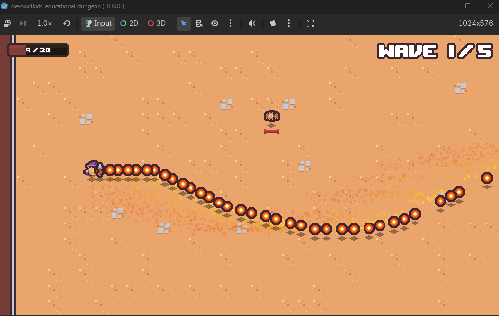

> Dans ce groupe, tu modifies uniquement des **fichiers de configuration** (.tres) directement dans l'éditeur Godot. Pas besoin d'écrire du code !
>
> Pour ouvrir un fichier `.tres` : double-clique dessus dans le panneau **FileSystem** (en bas à gauche). Ses propriétés s'affichent dans l'**Inspector** (à droite).

#### **Défi 1 - Lance le jeu et survie !**

Appuie sur **F5**. Joue quelques minutes. Essaie de survivre aux vagues d'ennemis. Combien de vagues peux-tu atteindre ?

#### **Défi 2 - Amuse toi à modifier les stats du sorcier !**

Ouvre `resources/player_stats/player_stats.tres` dans l'Inspecteur.

A droite, tu vas voir toutes les stats du sorcier, amuse toi à les modifier, et lance le jeu pour voir ce qu'il se passe.

* Speed: Vitesse de déplacement du sorcier (valeur initiale: 80)
* Hp Max: Points de vie du sorcier (valeur initiale: 30)
* Attack cooldown: Le délai entre chaque boule de feu (valeur initiale: 0.2)
* Damage Information: Les dégats de la boule de feu (valeur initiale: 3)

#### **Défi 3 - Écrase les chauves-souris en un coup**

Ouvre `resources/enemy_stats/bat_stats.tres`.
Change **`Hp Max`** à `1`. Les chauves-souris meurent maintenant en un seul tir !

- La valeur initiale était: `5`.

#### **Défi 4 - Fais exploser la vague 1**

Ouvre `resources/wave_data/wave1_data.tres`.
Dans la liste **`Sub Waves`**, clique sur le premier élément. Change **`Amount`** à `20`.
Lance le jeu — tu es envahi !

- La valeur initiale était: `1`.

### Groupe - Bidouilleur de Ressources

[Revenir aux étapes ⬆️](#étapes-de-latelier)

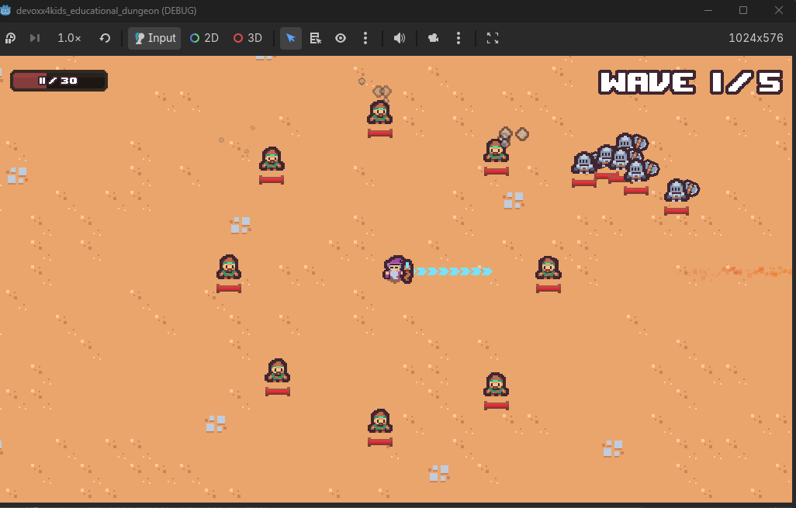

> Dans ce groupe, tu continues à modifier des fichiers `.tres`, mais tu explores plus en profondeur les configurations disponibles.

#### **Défi 5 — Change la formation d'apparition**

Dans `resources/wave_data/wave1_data.tres`, ouvre un `SubWaveData` et change **`Pattern`** :

- `RANDOM` : les ennemis apparaissent n'importe où
- `CIRCLE` : ils apparaissent en cercle autour de toi
- `CLUSTER` : ils apparaissent en groupe

- Les valeurs initiales étaient:
  - Subwave 0: `Random`
  - Subwave 1: `Random`
  - Subwave 2: `Cluster`
  - Subwave 3: `Cluster`
  - Subwave 4: `Random`
  - Subwave 5: `Circle`

#### **Défi 6 — Remplace les ennemis**

Dans la même vague, change **`Enemy Type`** pour `KNIGHT` ou `SPIDER`. Lance le jeu — surprise !

- Les valeurs initiales étaient:
  - Subwave 0: `Bat`
  - Subwave 1: `Bat`
  - Subwave 2: `Bat`
  - Subwave 3: `Ghost`
  - Subwave 4: `Bat`
  - Subwave 5: `Ghost`

#### **Défi 7 — Crée ton équilibre parfait**

Crée une vague 1 qui te semble fun à jouer et garde les changements que tu préfères !

---

### Groupe - Lecteur de Code

[Revenir aux étapes ⬆️](#étapes-de-latelier)

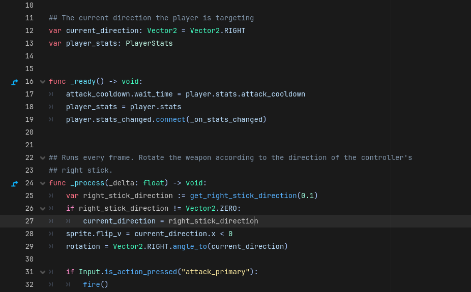

> Dans ce groupe, tu ouvres de vrais fichiers de code GDScript (`.gd`). L'objectif est de **lire et comprendre**, puis de faire de petites modifications.
>
> Pour ouvrir un script : double-clique dessus dans le **FileSystem**. Il s'ouvre dans l'éditeur de code.

#### **Défi 8 — Lis le déplacement du joueur**

Ouvre `src/scenes/entities/player/movement/player_movement.gd`.
Tu vois la ligne : `player.velocity = input_vector * player_stats.speed`
C'est ici que la vitesse est appliquée ! Modifie la ligne pour mettre `player_stats.speed * 2`. Qu'est-ce qui se passe ?

#### **Défi 9 — Accélère la boule de feu**

Ce défi ne peut être testé qu'avec une manette. Car un bug 🪳 s'est introduit dans le jeu et la visée à la souris ne fonctionne pas encore. Fais ce dernier défi pour essayer la menette et la souris, avant que tu puisses aller corriger le bug !

Ouvre `src/scenes/entities/player/fireball/fireball.gd`.
Trouve la variable `speed` dans le code, et de la même manière que dans le défi précédent, augmente la vitesse de la boule de feu.

Elle est aussi configurable depuis l'éditeur : dans la scène `fireball.tscn`, clique sur le nœud racine et cherche **`Speed`** dans l'Inspector. Change-la à `1000` !

<details>
<summary>Solution</summary>

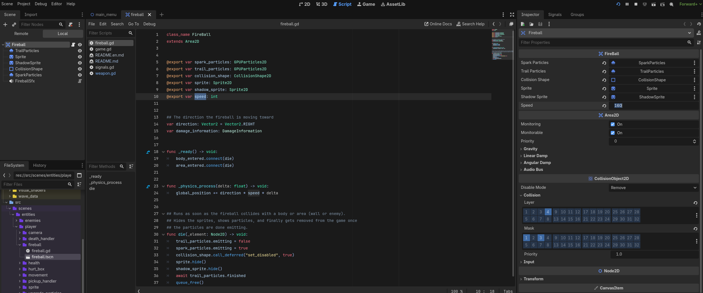

</details>

#### **Défi 10 — Comprends pourquoi la visée ne fonctionne pas**

Ouvre `src/scenes/entities/player/weapon/weapon.gd`.
Lis la fonction `_process`. Tu vois `get_right_stick_direction(0.1)` ?
C'est la direction du joystick droit (manette). Si personne n'utilise de manette, `current_direction` ne change jamais... et le sorcier tire toujours vers la droite. C'est le bug que tu vas corriger au prochain défi !

---

### Groupe - Codeur

[Revenir aux étapes ⬆️](#étapes-de-latelier)

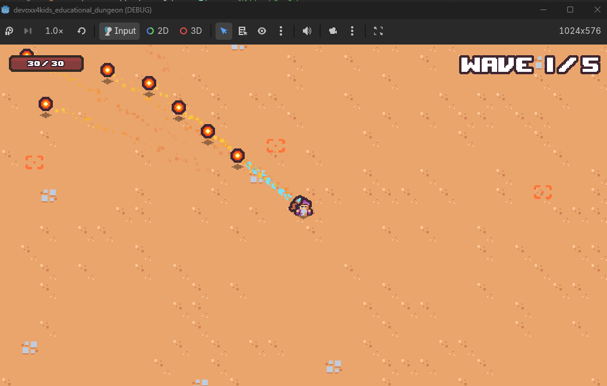

> Dans ce groupe, tu **écris du code** pour ajouter de nouvelles fonctionnalités. C'est la partie la plus difficile — mais aussi la plus satisfaisante ! 💪
>
> N'oublie pas de sauvegarder tes fichiers après chaque modification (**Ctrl+S**).

#### **Défi 11 — Répare la visée à la souris**

Dans `src/scenes/entities/player/weapon/weapon.gd`, trouve dans `_process` ce bloc :

```gdscript
var right_stick_direction := get_right_stick_direction(0.1) # lit le joystick droit
if right_stick_direction != Vector2.ZERO: # joystick utilisé ?
	current_direction = right_stick_direction # vise avec le joystick
```

À toi de jouer ! Ajoute un bloc `else` juste après le `if`. Dans ce `else`, tu dois mettre à jour `current_direction` avec la direction qui pointe vers la souris.

Voici les outils dont tu disposes :

- `get_global_mouse_position()` — retourne la position de la souris dans le monde du jeu
- `global_position` — la position de l'arme dans le monde du jeu
- `.direction_to()` — donne la direction d'un point vers un autre

**Indice :** ici, tu dois :

- Ajouter `else` à l’instruction `if` — rappelle-toi des bases du code qu’on a vues au début de l’atelier !
- Écrire cette ligne sous le `else`, mais en programmation avec les outils : `current direction = (global mouse position - global position).normalized`

<details>
<summary>Solution</summary>

Ajoute un `else` pour viser vers la souris si aucun joystick n'est utilisé :

```gdscript
var right_stick_direction := get_right_stick_direction(0.1) # lit le joystick droit
if right_stick_direction != Vector2.ZERO: # joystick actif ?
	current_direction = right_stick_direction # vise avec le joystick
else:
	current_direction = global_position.direction_to(get_global_mouse_position()) # vise vers la souris
```

</details>

Lance le jeu — tu peux maintenant viser avec ta souris ! 🎯

**Que fait cette nouvelle ligne ?**
`global_position` c'est la position du sorcier dans le jeu
`get_global_mouse_position()` donne la position de ta souris dans le monde du jeu.
On utilise `.direction_to()` pour avoir le vecteur qui va du joueur vers la souris.

**Pourquoi on l'ajoute dans le `else` ?**
Le `if` gère déjà la visée avec le joystick droit d'une manette.
Le `else` s'exécute uniquement quand **aucun joystick n'est utilisé** — c'est donc là qu'on branche la souris.
Ainsi le jeu fonctionne avec les deux types de contrôle, sans que l'un interfère avec l'autre.

---

### Groupe - Score

[Revenir aux étapes ⬆️](#étapes-de-latelier)

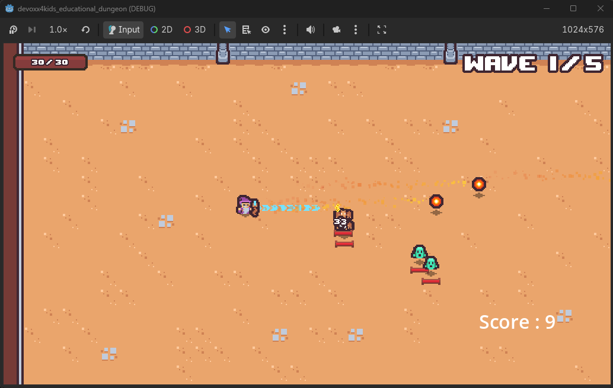

> Dans ce groupe, tu vas **ajouter un système de score** au jeu — tu apprendras à utiliser les signaux, les bonnes pratiques de code, et tu afficheras un compteur de kills en temps réel à l'écran.

#### **Défi 12 — Ajoute une variable de score**

Créons un score visible à l'écran pour suivre combien d'ennemis nous avons tué !

Ouvre `src/scripts/autoloads/game_data.gd`.
À la fin du fichier, ajoute cette ligne :

```gdscript
var score: int = 0
```

Mais attention, tous les programmeurs savent qu'une variable nommée `score`, ne décrit pas assez à quoi elle sert.
Mettons en place une bonne pratique très importante de la programmation ici pour faciliter la relecture du code, par toi ou quelqu'un d'autre.
Ajoute un commentaire indiquer en anglais que cette variable sert à compter le nombre d'ennemis tués

<details>
<summary>Solution</summary>

```gdscript
## Total number of ennemies killed
var score: int = 0
```

## </details>

`GameData.score` sera maintenant accessible depuis n'importe quel script du jeu.

#### **Défi 13 — Découvre les signaux**

Ouvre `src/scripts/autoloads/signals.gd`.
Tu vois `signal enemy_died(enemy: Enemy)` ? C'est un **signal** : quand un ennemi meurt, ce signal est envoyé à tous ceux qui l'écoutent.
Qui l'écoute déjà ? Cherche `enemy_died.connect` dans le projet (menu **Project > Find in Files**).

#### **Défi 14 — Augmente le score à chaque kill**

Dans `src/scripts/autoloads/game_data.gd`, ajoute une fonction pour écouter le signal `enemy_died` :

```gdscript
## Connecte le signal de mort d'ennemi
func _ready() -> void:
	Signals.enemy_died.connect(_on_enemy_died) # écoute la mort des ennemis

## Appelée quand un ennemi meurt
func _on_enemy_died(_enemy: Enemy) -> void:
	score += 1 # incrémente le score
	print("Score : ", score) # affiche dans la console
```

Lance le jeu et regarde la console en bas de Godot — le score monte à chaque ennemi tué !

Si tu ne te rapelles pas oú la console dans Godot, [retournes voir ce dessin](#comment-fonctionne-godot-)

#### **Défi 15 — Affiche le score à l'écran**

Ouvre la scène `src/scenes/ui/hud/hud.tscn`.

Dans l'arbre de scène (à gauche), fais un clic droit sur le nœud racine nommé `Hud` et ajoute un nœud **Label**. Nomme-le `ScoreLabel`.
Ensuite, fais à nouveau un clic droit sur le noeud `Hud`. Il n'a pas encore de script attaché pour mettre à jour ce label, faisons le :

1. Clic droit sur `Hud`
2. Attacher un Script
3. Une fenêtre s'ouvre, ne change rien et clique sur `Create`
4. Changes le contenu du fichier pour ajouter et remplacer ce code

```gdscript
@onready var score_label: Label = $ScoreLabel # référence au Label de score

[...]

## Met à jour l'affichage du score chaque frame
func _process(_delta: float) -> void:
	score_label.text = "Score : " + str(GameData.score) # affiche le score actuel
```

Finalement, cliques sur "2D" dans la barre tout en haut de la fenêtre de cet editeur pour rentrer dans l'édition visuelle de la scène.
Dans l'arborescence sur la gauche, sélectionnes avec un clic gauche, le "ScoreLabel" que tu viens de créer, tu le vois maintenant surligné en rouge dans la scène 2D que tu as précedemment ouverte.

Place le oú tu veux dans la zone bleue et lance le jeu pour vérifier qu'il fonctionne correctement !

<details>
<summary>Solution</summary>

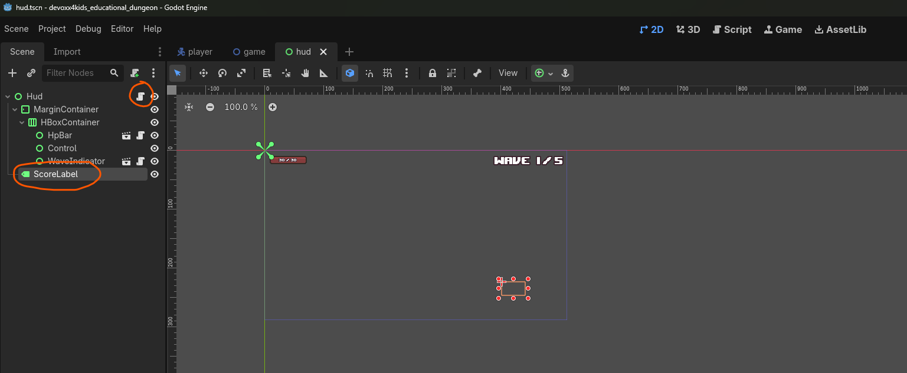

</details>

#### **Défi 16 — Compte le temps de survie**

Ouvre `src/scripts/autoloads/game_data.gd`.
Ajoute une variable et une fonction pour mesurer le temps écoulé :

```gdscript
var survival_time: float = 0.0 # temps de survie en secondes

## Incrémente le temps de survie chaque frame
func _process(delta: float) -> void:
	survival_time += delta # ajoute le temps écoulé
```

`GameData.survival_time` contient maintenant le nombre de secondes depuis le début de la partie !

#### **Défi 17 — Affiche le temps de survie à l'écran**

Ouvre `src/scenes/ui/hud/hud.tscn`. Ajoute un nœud **Label** et nomme-le `TimeLabel`.
Dans le script du HUD, ajoute ou complète la fonction `_process` pour afficher le temps :

```gdscript
@onready var time_label: Label = $TimeLabel # référence au Label de temps

[...]

## Met à jour le chrono affiché chaque frame
func _process(_delta: float) -> void:
	time_label.text = str(int(GameData.survival_time)) + "s" # affiche le temps en entier
```

Va dans le viewport `2D` et place le temps oú tu veux sur l'écran.

---

### Groupe - Une Vague de Plus

[Revenir aux étapes ⬆️](#étapes-de-latelier)

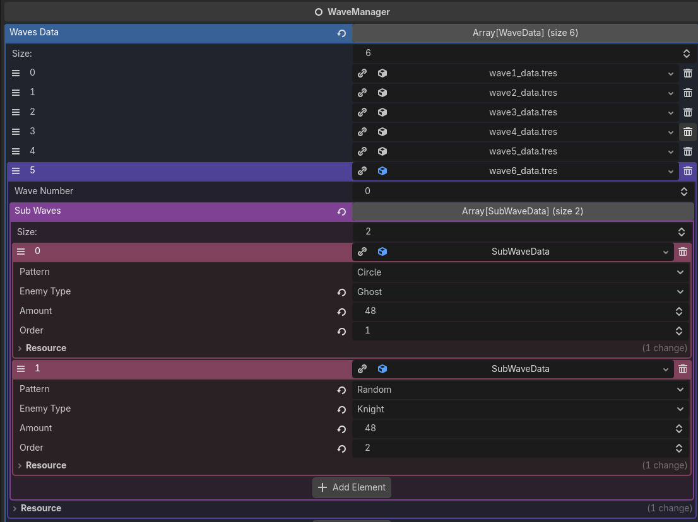

> Dans ce groupe, tu vas **concevoir ta propre vague d'ennemis** de A à Z et l'ajouter au jeu. Pas de code requis — c'est un défi de game design !

#### **Défi 18 — Crée une vague 6**

Dans le FileSystem, fais un clic droit sur `resources/wave_data/wave5_data.tres` et choisis **Duplicate**. Renomme le fichier en `wave6_data.tres`.
Ouvre-la et crée la vague la plus difficile que tu puisses imaginer ! Plus d'ennemis, des knights, des archers...

<details>
<summary>Solution</summary>

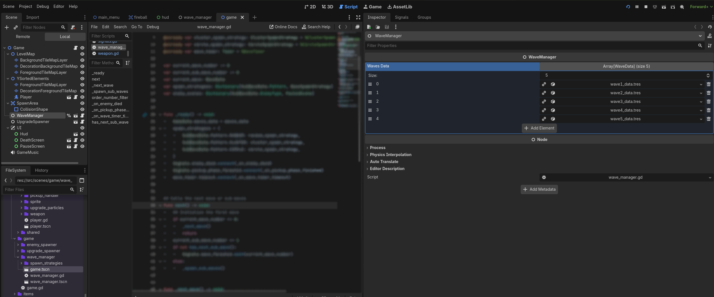

</details>

#### **Défi 19 — Ajoute ta vague 6 au jeu**

Ouvre la scène `src/scenes/game/wave_manager/game.tscn`. Clique sur le nœud **WaveManager** dans l'arbre. Dans l'Inspector, trouve le tableau **`Waves Data`** et clique sur le **+** pour ajouter une entrée. Sélectionne ton fichier `wave6_data.tres`.
Lance le jeu et survie jusqu'à ta vague !

**Astuce**: si tu veux gagner du temps pour tester, après avoir ajouté ta vague dans dans le WaveManager, utilise les 3 barres sur la gauche du chiffre dans la colonne `Waves Data` pour remonter ta wave et la placer en première.

<details>
<summary>Solution</summary>

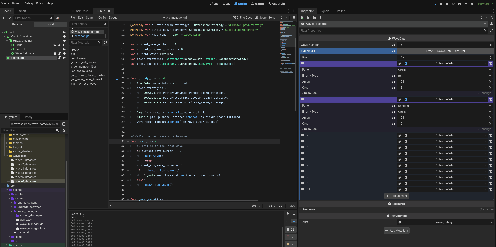

</details>

#### **Défi 20 — N'oublies pas le UpgradeSpawner pour les bonus entre les vagues !**

Dans la même scène `src/scenes/game/wave_manager/game.tscn`, clique sur le nœud **UpgradeSpawner** dans l'arbre de scène.

Dans l'Inspector, trouve le tableau **`Waves Data`** et ajoute une entrée pour ta 6ème vague — sinon les bonus entre les vagues ne s'afficheront pas après la vague 5 !

<details>
<summary>Solution</summary>

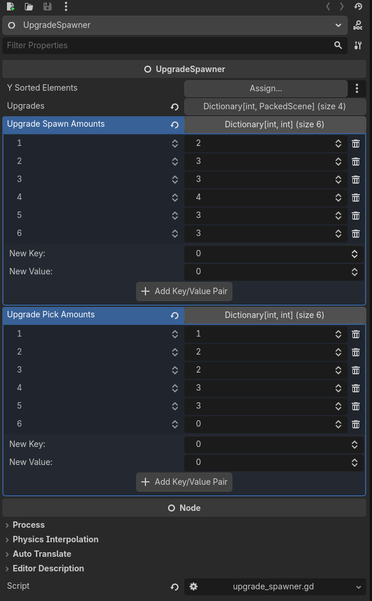

</details>

---

### Groupe - Artiste Pixel Art

[Revenir aux étapes ⬆️](#étapes-de-latelier)

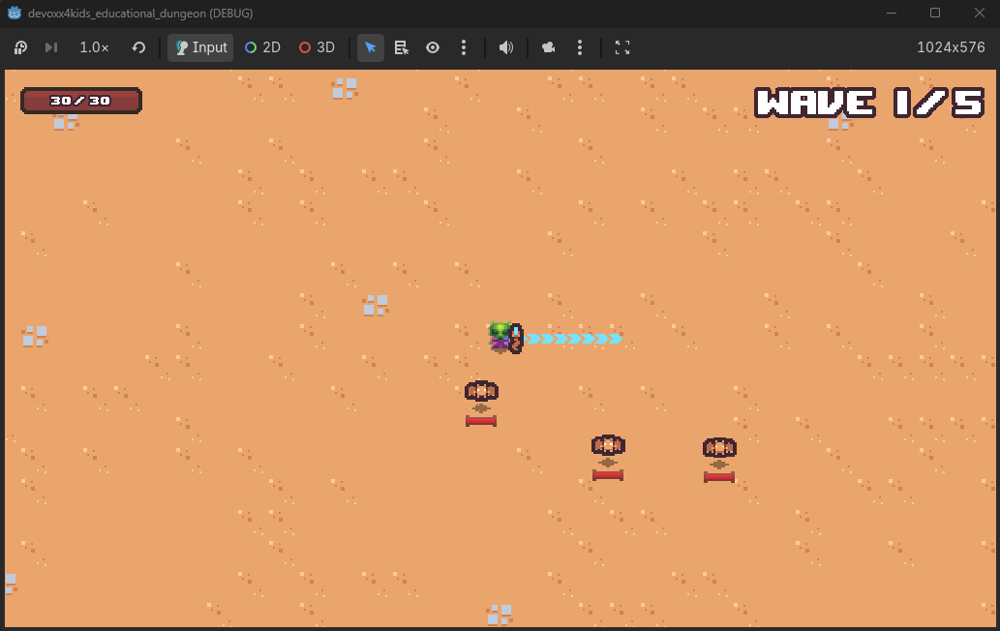

> Dans ce groupe, tu vas **changer l'apparence visuelle du sorcier** en remplaçant son image par un personnage open source trouvé sur internet. Pas besoin d'écrire du code — c'est une mission de graphisme !
>
> Les sprites open source sont des images libres de droits que la communauté met à disposition gratuitement. C'est comme ça que fonctionne l'Open Source dans le monde de l'art !

#### **Défi 21 — Observe le sprite actuel du sorcier**

Dans le FileSystem, navigue jusqu'au dossier `assets/sprites/entities/`.
Double-clique sur `mage.png` pour le prévisualiser dans la colonne de droite. C'est cette image qui représente ton sorcier dans le jeu !

##### Pixel Art

Rends-toi sur [OpenGameArt.org](https://opengameart.org/), un site de ressources artistiques open source et gratuites pour les jeux vidéo.
Dans la barre de recherche, cherche **"top down character"** ou **"pixel art character"**.
Ce sont ces personnages qui peuvent être intégrés gratuitement dans les jeux vidéos comme celui-ci.

Puisque souvent ces images demandent un peu d'adaptation, nous avons préparé pour toi, quelques autres personnages qui sont déjà dans le dossier `assets/sprites/entities/`.
Choisit un des personnages suivants: `girl.png`, `boy.png`, `sumo.png`, `mage.png` ou même prends l'apparence d'un enemi avec `archer.png`

##### Changes d'apparence

Dans le FileSystem, ouvre `src/scenes/entities/player/sprite/player_sprite.tscn` en double-cliquant dessus.

- Clique sur le nœud **PlayerSprite** dans l'arbre de scène.
- Dans l'Inspector à droite, trouve la propriété **Texture**.
- **Glisse ton nouveau PNG** depuis le FileSystem jusqu'à cette propriété. L'apparence du sorcier change !
- Lance le jeu avec **F5** pour voir ton personnage en action.

---

### Groupe - Architecte

[Revenir aux étapes ⬆️](#étapes-de-latelier)

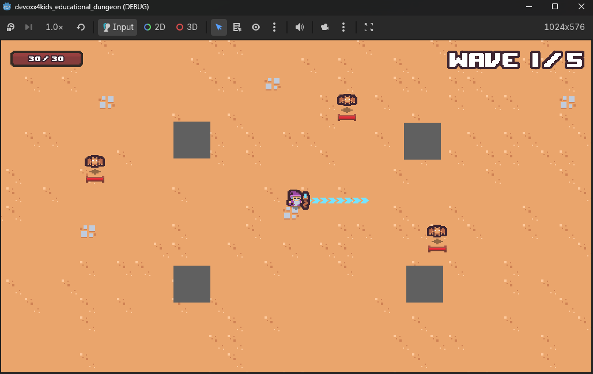

> Dans ce groupe, tu vas **ajouter des murs** dans l'arène pour créer des obstacles physiques. Le sorcier et les ennemis ne pourront pas les traverser — ça change complètement la façon de jouer !
>
> Dans Godot, un objet qui bloque les autres s'appelle un **StaticBody2D** (corps statique). On lui ajoute une **CollisionShape2D** pour définir sa forme, et un visuel pour le voir à l'écran.

#### **Défi 22 — Ouvre la scène principale du jeu**

Dans le FileSystem, navigue jusqu'à `src/scenes/game/wave_manager/` et double-clique sur **`game.tscn`**. Cliques dans la barre du haut sur `2D`.
Tu vois l'arène du jeu dans le Viewport. C'est ici que tu vas placer tes murs !

##### Crée ton premier mur

Dans l'arbre de scène à gauche, fais un **clic droit sur le nœud `LevelMap`** et choisis **Add Child Node**.
Cherche **`StaticBody2D`** et clique **Create**.
Renomme-le `Mur1` (double-clique sur le nœud dans l'arbre de scène pour le renommer).

##### Donne-lui une forme de collision

- Fais un clic droit sur **`Mur1`** et ajoute un nœud enfant **`CollisionShape2D`**
- Clique sur ce nœud dans l'arbre
- Dans l'Inspector, clique sur **Shape** puis choisis **New RectangleShape2D**
- Cliques à nouveau sur `RectangleShape2D`, pour ajuster la `Size`. configures **`x = 32`, `y = 32`**

<details>
<summary>Solution</summary>

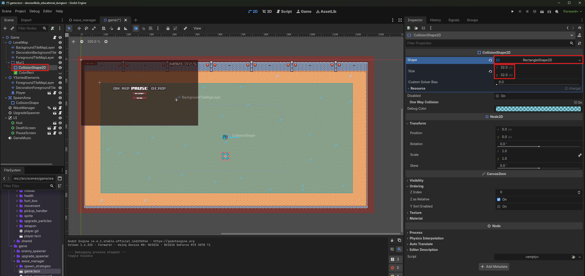

</details>

> 💡 Si tu as du mal à sélectionner ton mur, voici deux astuces:
>
> - Dans ta liste de scènes, sélectionnes ton `Mur1` puis, sur ton clavier, reste appuyé sur la touche "Alt". Tu verras apparaitre sur ton object dans le viewport, **deux flèches: un verte et un rouge**. Avec la souris, sers toi de ces flèches pour bouger ton mur.
> - C'est aussi peut être parceque tu es gêné par un autre élément. Par exemple, si c'est le `Spawn Area` car il prend beaucoup de place. Dans ce cas là, trouve le dans la liste des scnès, et clique sur le petit oeil blanc qui est sur la même ligne, ça permettra de le cacher temporairement afin de te laisser éditer ton mur plus facilement. N'oublies pas de le remettre avant de lancer le jeu !

##### Rends le mur visible

Fais un clic droit sur **`Mur1`** et ajoute un nœud enfant **`ColorRect`**.

Puis, dans l'Inspector:

- Change **Color** à une couleur pierre (par exemple gris foncé `#606060`).
- Sous `Layout > Transform`:
  - Change **Size** à **`x = 32`, `y = 32`** et
  - Change aussi la **Position** à **`x = -16`, `y = -16`** pour le centrer sur le mur.

<details>
<summary>Solution</summary>

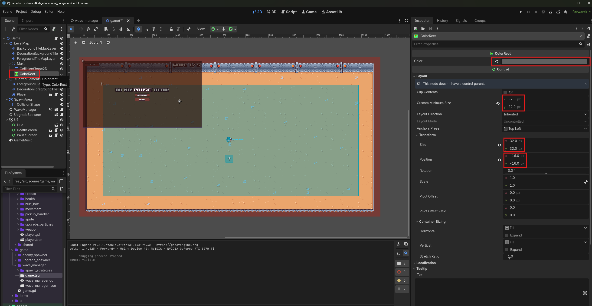

</details>

##### Duplique et positionne 4 murs

Fais un **clic droit sur `Mur1`** dans l'arbre de scène et choisis **Duplicate** — répète 3 fois pour avoir `Mur2`, `Mur3` et `Mur4`.

Pour chaque mur, sélectionne-le et place les oú tu veux !

Lance le jeu — le sorcier et les ennemis ne peuvent plus traverser tes murs !

---

### Groupe - Codeur Créatif

[Revenir aux étapes ⬆️](#étapes-de-latelier)

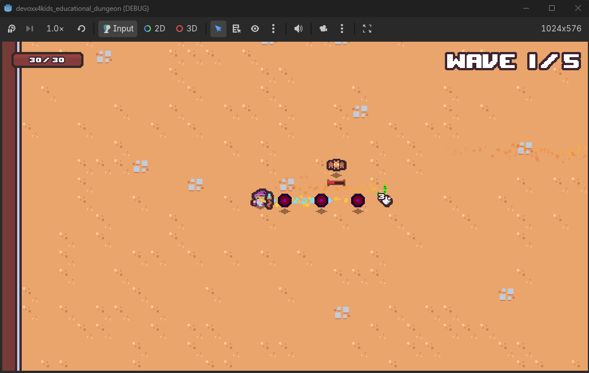

> Dans ce groupe, tu **écris du code** pour personnaliser le jeu selon tes envies. Ces défis ne sont pas forcément plus difficiles — ils t'apprennent à **exprimer ta créativité avec le code** !

#### **Défi 23 — Change la couleur des boules de feu**

Ouvre `src/scenes/entities/player/fireball/fireball.gd`.
Dans la fonction `_ready()`, après les deux lignes existantes, ajoute :

```gdscript
sprite.modulate = Color(0.5, 0, 1)  # boules de feu violettes !
```

Lance le jeu. Essaie d'autres couleurs : `Color.GREEN`, `Color.BLUE`, `Color(1, 0.5, 0)` pour l'orange, `Color.RED`…

#### **Défi 24 — Change la couleur de l'explosion**

Dans le même fichier `fireball.gd`, toujours dans `_ready()`, ajoute aussi :

```gdscript
spark_particles.modulate = Color(0, 1, 0)  # étincelles vertes !
```

Lance le jeu et tire des boules de feu — les étincelles à l'impact changent de couleur !

---

<!--
### Groupe - Ajoutes une nouvelle arme laser

[Revenir aux étapes ⬆️](#étapes-de-latelier)

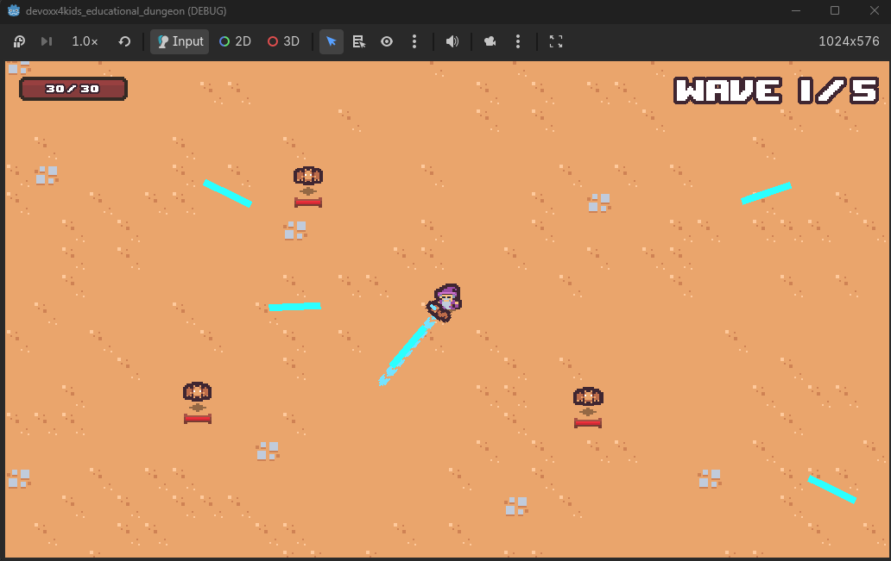

> Dans ce groupe, tu vas ajouter une **deuxième arme** au sorcier : un rayon laser tiré avec le clic droit ! Tu vas écrire un nouveau script de zéro, créer une scène, et connecter le tout au système d'armes existant. C'est le défi le plus ambitieux !

#### **Défi 28 — Explore le code de la boule de feu**

Avant de créer quoi que ce soit, comprends comment fonctionne la boule de feu.

Ouvre `src/scenes/entities/player/fireball/fireball.gd`. Lis-le entièrement.

- Quelle classe est-ce qu'il étend ? (`Area2D`)
- Quelles variables `@export` a-t-il ?
- Que fait la fonction `die()` ?

Maintenant ouvre `src/scenes/entities/player/weapon/weapon.gd`. Lis la fonction `spawn_fireball()`.

- Que fait `NodeUtil.instance_2d_scene_at_location` ?
- Quelles deux propriétés sont définies sur la boule de feu avant de tirer ?

Tu as maintenant tous les outils pour créer le laser ! 🔍

#### **Défi 29 — Crée le script du laser**

Dans le FileSystem, fais un clic droit sur `src/scenes/entities/player/` et choisis **New Folder**. Nomme-le `laser`.

Dans ce nouveau dossier, clic droit → **New Script**. Nomme-le `laser.gd`.

Ton laser doit :

1. Se déplacer dans une direction à grande vitesse (`speed = 400` — contre `160` pour la boule de feu)
2. **Tourner pour pointer dans sa direction** (`rotation = direction.angle()`) pour que le trait soit orienté correctement
3. Disparaître instantanément au premier contact — avec une garde pour éviter les double-appels

**Indice :** Inspire-toi de `fireball.gd`. Les différences clés :

- Garde seulement `@export var speed: int = 400` — pas besoin de références aux nœuds enfants
- Dans `_physics_process`, ajoute `rotation = direction.angle()` **avant** le déplacement
- `die()` appelle `set_deferred("monitoring", false)` sur `self` (l'Area2D lui-même) — aucun nœud enfant requis
- Ajoute `var is_dying: bool = false` pour bloquer les double-appels

<details>
<summary>Solution</summary>

```gdscript
class_name Laser
extends Area2D

@export var speed: int = 400 # vitesse du laser (px/sec)

var direction: Vector2 = Vector2.RIGHT # direction de déplacement
var damage_information: DamageInformation # dégâts infligés
var is_dying: bool = false # garde anti-double-appel


## Connecte les signaux de collision au démarrage
func _ready() -> void:
	body_entered.connect(die) # collision avec un corps physique
	area_entered.connect(die) # collision avec une zone


## Déplace et oriente le laser chaque frame
func _physics_process(delta: float) -> void:
	rotation = direction.angle() # oriente le trait dans sa direction
	global_position += direction * speed * delta # avance dans la direction


## Détruit le laser à la première collision
func die(_element: Node2D) -> void:
	if is_dying: # déjà en train de mourir ?
		return # on ignore le double-appel
	is_dying = true # marque comme en train de mourir
	set_deferred("monitoring", false) # désactive les collisions
	queue_free() # supprime le nœud
```

</details>

Sauvegarde avec **Ctrl+S**.

#### **Défi 30 — Crée la scène du laser**

Le laser sera dessiné avec un nœud **Line2D** — un trait cyan qui tourne dans la direction de tir. Pas de sprite, pas de particules : un vrai rayon !

Dans le FileSystem, fais un clic droit sur `src/scenes/entities/player/fireball/fireball.tscn` et choisis **Duplicate**. Déplace le nouveau fichier dans le dossier `laser/` et renomme-le `laser.tscn`.

Ouvre `laser.tscn` en double-cliquant dessus.

**1 — Change le script :**

- Dans l'arbre de scène, renomme le nœud racine de `Fireball` à `Laser`.
- Clique sur l'icône script (📜) dans l'Inspector → détache `fireball.gd` → glisse `laser.gd` sur la propriété **Script**.
- Mets `Speed` à `400` dans l'Inspector.

**2 — Supprime les nœuds de la boule de feu :**

Sélectionne et supprime ces nœuds dans l'arbre de scène (sélectionne → touche `Suppr`) :

- `TrailParticles`
- `SparkParticles`
- `ShadowSprite`
- `FireballSfx`
- `Sprite`

**3 — Ajoute le rayon laser :**

Fais un clic droit sur le nœud racine **Laser** → **Add Child Node** → cherche **`Line2D`** → **Create**.

Sélectionne le nœud **Line2D** et dans l'Inspector :

- **Default Color** → mets la couleur cyan : clique sur la case de couleur et entre `(R: 0, G: 255, B: 255)`
- **Width** → `4`
- **Points** → clique **+** deux fois pour ajouter deux points :
  - Point 0 : `x = 0, y = 0`
  - Point 1 : `x = 30, y = 0`

Sauvegarde avec **Ctrl+S**.

> 💡 La Line2D trace un trait du point 0 au point 1. Comme le laser tourne dans `_physics_process`, il pointera toujours dans sa direction de déplacement !

#### **Défi 31 — Connecte le laser à l'arme**

Ouvre `src/scenes/entities/player/weapon/weapon.gd`.

Sous `@export var fireball_scene: PackedScene`, ajoute un nouvel export pour le laser :

```gdscript
@export var laser_scene: PackedScene
```

À la fin de la fonction `_process` (après le bloc `attack_primary`), ajoute :

```gdscript
	if Input.is_action_just_pressed("attack_secondary"): # clic droit pressé ?
		fire_laser() # tire un laser
```

Ensuite, ajoute ces deux nouvelles fonctions après `spawn_fireball()` :

```gdscript
## Tire un laser si la scène est assignée
func fire_laser() -> void:
	if laser_scene: # la scène laser est-elle définie ?
		spawn_laser() # crée le laser

## Instancie et configure le laser
func spawn_laser() -> void:
	var laser := NodeUtil.instance_2d_scene_at_location(laser_scene, self, global_position) as Laser # crée le laser
	laser.direction = current_direction # définit sa direction
	laser.damage_information = player_stats.damage_information # définit ses dégâts
```

Sauvegarde avec **Ctrl+S**.

**Configure le clic droit :**
Va dans **Project > Project Settings > Input Map**, trouve `attack_secondary` et clique sur **+** pour ajouter un événement. Appuie sur le **bouton droit de la souris** — il devrait apparaître dans la liste.

**Assigne la scène dans l'éditeur :**
Ouvre `src/scenes/entities/player/weapon/weapon.tscn`, sélectionne le nœud **Weapon**, et dans l'Inspector glisse `laser.tscn` sur la propriété **Laser Scene**.

Lance le jeu — **clic gauche** tire des boules de feu, **clic droit** tire des lasers ! 🔵
-->

---

### Groupe - Ajoutes une nouvelle arme rayon laser

[Revenir aux étapes ⬆️](#étapes-de-latelier)

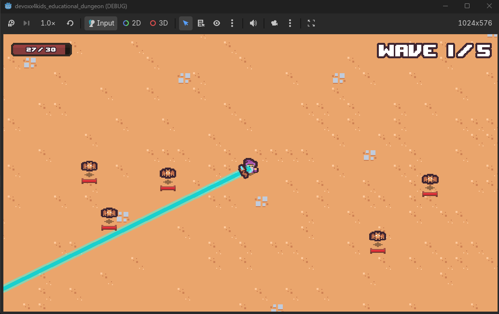

> Dans ce groupe, tu vas créer un **rayon laser continu** — il reste actif jusqu'à ce qu'un ennemi meure ! Au lieu de faire des dégâts par impact, il fait des **dégâts au fil du temps**. Tu vas utiliser un nouvel outil de Godot appelé `RayCast2D` pour détecter ce qui se trouve sur le chemin du laser à chaque frame.

#### **Défi 25 — Comprendre le RayCast2D**

Un `RayCast2D` envoie un rayon invisible depuis un point dans une direction. À chaque frame, il répond à la question : « Est-ce que j'ai touché quelque chose ? Si oui, quoi et où exactement ? »

Contrairement à l'`Area2D` utilisée pour les boules de feu (qui détecte les chevauchements entre formes), un `RayCast2D` donne toujours le **premier** objet sur son chemin — parfait pour un rayon laser qui s'arrête au premier ennemi ou mur rencontré.

Ouvre `src/scenes/entities/player/weapon/weapon.gd` et lis la fonction `spawn_fireball()`.

- La boule de feu est un projectile : elle est créée, puis se déplace seule à chaque frame.
- Le laser continu est différent : **il ne bouge pas**. Il reste attaché à l'arme, tourne avec elle, et lit le point de collision du raycast à chaque frame pour dessiner le rayon.

Réfléchis :

- Pourquoi `RayCast2D` est-il meilleur qu'un long `Area2D` pour un rayon ?
- Quelle est la différence entre « 10 dégâts par impact » et « 10 dégâts par seconde » ?

#### **Défi 26 — Crée la scène du laser continu**

Crée un nouveau dossier `src/scenes/entities/player/continuous_laser/`.

À l'intérieur, clic droit → **New Scene**. Choisis **Node2D** comme racine et nomme-la `ContinuousLaser`. Sauvegarde sous `continuous_laser.tscn`.

Ajoute trois nœuds enfants à `ContinuousLaser` :

**1 — RayCast2D :**
Clic droit sur `ContinuousLaser` → Add Child Node → `RayCast2D`.
Dans l'Inspector :

- `Target Position` : `x = 400, y = 0`
- `Collision Mask` : clique sur la grille et active **la couche 1** (world) et **la couche 6** (enemy_physics)

**2 — Line2D :**
Clic droit sur `ContinuousLaser` → Add Child Node → `Line2D`.
Dans l'Inspector :

- **Default Color** → cyan `(R: 0, G: 255, B: 255)`
- **Width** → `4`
- **Points** → clique **+** deux fois :
  - Point 0 : `x = 0, y = 0`
  - Point 1 : `x = 400, y = 0`

**3 — Timer** (renomme-le `DamageTimer`) :
Clic droit sur `ContinuousLaser` → Add Child Node → `Timer`. Renomme-le `DamageTimer`.
Dans l'Inspector :

- `Wait Time` : `0.05`
- `One Shot` : ❌
- `Autostart` : ❌

Sauvegarde avec **Ctrl+S**.

> 💡 Puisque `ContinuousLaser` sera un **enfant de l'Arme**, il tourne automatiquement avec elle — le rayon pointera toujours dans la direction visée par le sorcier !

#### **Défi 27 — Écris le script du laser continu**

Dans le dossier `src/scenes/entities/player/continuous_laser/`, crée un nouveau script `continuous_laser.gd` et attache-le au nœud `ContinuousLaser`.

Le script doit :

1. `activate(dmg_info)` — rendre le rayon visible et démarrer le timer de dégâts
2. `deactivate()` — cacher le rayon et arrêter le timer
3. Dans `_process` — mettre à jour l'extrémité de la Line2D pour suivre le point de collision du raycast à chaque frame
4. Au timeout de `DamageTimer` — trouver l'ennemi que le raycast touche et appeler `hurt.emit()`
5. Quand `Signals.enemy_died` se déclenche — appeler automatiquement `deactivate()`

**Indices :**

- `raycast.get_collision_point()` retourne la position de collision en espace **global** — utilise `to_local(...)` pour la convertir en espace local du nœud pour la Line2D
- Pour trouver la hurtbox de l'ennemi : `body.find_child("EnemyHurtBox") as EnemyHurtBox`, puis appelle `hurtbox.hurt.emit(damage_information)`
- Commence avec `visible = false` dans `_ready()` — le laser est éteint par défaut

<details>
<summary>Solution</summary>

```gdscript
class_name ContinuousLaser
extends Node2D

@onready var raycast: RayCast2D = $RayCast2D # rayon de détection
@onready var line: Line2D = $Line2D # trait visuel du laser
@onready var damage_timer: Timer = $DamageTimer # timer de dégâts périodiques

var damage_information: DamageInformation # dégâts à infliger
var is_active: bool = false # laser actif ?
var needs_rearm: bool = false # doit relâcher avant de retirer ?


## Initialise les connexions et cache le laser
func _ready() -> void:
	damage_timer.timeout.connect(_on_damage_timer_timeout) # connecte le timer
	Signals.enemy_died.connect(_on_enemy_died) # écoute la mort des ennemis
	visible = false # laser éteint par défaut


## Active le laser et démarre les dégâts
func activate(dmg_info: DamageInformation) -> void:
	damage_information = dmg_info # stocke les infos de dégâts
	is_active = true # marque comme actif
	needs_rearm = false # réinitialise le verrou
	visible = true # rend le laser visible
	damage_timer.start() # démarre le timer de dégâts


## Désactive le laser et arrête les dégâts
func deactivate() -> void:
	is_active = false # marque comme inactif
	visible = false # cache le laser
	damage_timer.stop() # arrête le timer de dégâts


## Met à jour l'extrémité du rayon chaque frame
func _process(_delta: float) -> void:
	if not is_active: # laser inactif ?
		return # rien à faire
	if raycast.is_colliding(): # le rayon touche quelque chose ?
		line.set_point_position(1, to_local(raycast.get_collision_point())) # pointe vers l'impact
	else:
		line.set_point_position(1, Vector2(400, 0)) # longueur maximale


## Inflige des dégâts à l'ennemi touché
func _on_damage_timer_timeout() -> void:
	if not raycast.is_colliding(): # rien touché ?
		return # pas de dégâts
	var body = raycast.get_collider() # récupère l'objet touché
	var hurtbox := body.find_child("EnemyHurtBox") as EnemyHurtBox # cherche la hurtbox
	if hurtbox: # hurtbox trouvée ?
		hurtbox.hurt.emit(damage_information) # inflige les dégâts


## Désactive le laser quand un ennemi meurt
func _on_enemy_died(_enemy: Enemy) -> void:
	deactivate() # éteint le laser
	needs_rearm = true # bloque la réactivation auto
```

</details>

Sauvegarde avec **Ctrl+S**.

#### **Défi 28 — Connecte le laser continu à l'arme**

**Ajoute la scène à l'arme :**
Ouvre `src/scenes/entities/player/weapon/weapon.tscn`. Dans l'arbre de scène, clic droit sur le nœud racine **Weapon** → **Instantiate Child Scene** → sélectionne `continuous_laser.tscn`.

Le nœud `ContinuousLaser` est maintenant enfant de l'Arme. Comme l'Arme tourne vers la souris, le laser suit automatiquement !

**Modifie `weapon.gd` :**
Ouvre `src/scenes/entities/player/weapon/weapon.gd`.

Ajoute cette ligne avec les autres variables `@onready` en haut :

```gdscript
@onready var continuous_laser: ContinuousLaser = $ContinuousLaser
```

Dans `_process`, remplace le bloc `attack_secondary` par :

```gdscript
	if Input.is_action_pressed("attack_secondary"): # clic droit maintenu ?
		if not continuous_laser.is_active and not continuous_laser.needs_rearm: # peut activer ?
			continuous_laser.activate(player_stats.damage_information) # active le laser
	else:
		continuous_laser.needs_rearm = false # libère le verrou de réarmement
		if continuous_laser.is_active: # laser encore actif ?
			continuous_laser.deactivate() # éteint le laser
```

> 💡 Le laser reste actif tant que le bouton est maintenu. Si un ennemi meurt, `needs_rearm` bloque la réactivation automatique — le joueur doit relâcher puis ré-appuyer.

Lance le jeu — **maintiens le clic droit** pour déclencher le laser continu. Relâche pour l'éteindre, ou laisse-le tuer un ennemi et il s'éteindra automatiquement ! ⚡

#### **Défi 29 — Ajoute un effet de lueur au rayon**

Un vrai rayon laser a une lueur autour de lui ! On va ajouter une deuxième `Line2D` plus large et semi-transparente derrière le rayon principal pour simuler cet effet.

**Dans `continuous_laser.tscn` :**

Dans l'arbre de scène, fais un clic droit sur le nœud racine `ContinuousLaser` → **Add Child Node** → `Line2D`. Renomme-le `GlowLine`.

Sélectionne `GlowLine` et dans l'Inspector :

- **Default Color** → cyan semi-transparent : `(R: 0, G: 255, B: 255, A: 60)`
- **Width** → `8`
- **Points** → clique **+** deux fois :
  - Point 0 : `x = 0, y = 0`
  - Point 1 : `x = 400, y = 0`

Dans l'arbre de scène, **glisse `GlowLine` au-dessus de `Line2D`** pour qu'il s'affiche derrière le rayon principal.

Sauvegarde avec **Ctrl+S**.

**Dans `continuous_laser.gd` :**

Ajoute une référence au nœud `GlowLine` avec les autres `@onready` :

```gdscript
@onready var glow: Line2D = $GlowLine
```

Dans la fonction `_process`, mets à jour le point final de `glow` en même temps que `line` :

```gdscript
## Met à jour rayon et lueur chaque frame
func _process(_delta: float) -> void:
	if not is_active: # laser inactif ?
		return # rien à faire
	if raycast.is_colliding(): # collision détectée ?
		var hit := to_local(raycast.get_collision_point()) # point d'impact en local
		line.set_point_position(1, hit) # met à jour le rayon
		glow.set_point_position(1, hit) # met à jour la lueur
	else:
		line.set_point_position(1, Vector2(400, 0)) # longueur max du rayon
		glow.set_point_position(1, Vector2(400, 0)) # longueur max de la lueur
```

Lance le jeu — le rayon a maintenant une auréole lumineuse autour de lui ! ✨

#### **Défi 30 — Ajoute un son de laser**

**Dans `continuous_laser.tscn` :**

Clic droit sur `ContinuousLaser` → Add Child Node → `AudioStreamPlayer`. Renomme-le `LaserSfx`.

Dans l'Inspector :

- **Stream** → glisse `assets/sounds/sfx/continuous_laser.wav` depuis le FileSystem
- **Autoplay** : ❌
- Dans la section **Looping** du fichier audio (double-clique sur `continuous_laser.wav` dans le FileSystem) → active **Loop**
- Si ça ne fonctionne pas ici, c'est que le fichier importé est en lecture seule regarde la solution ci-dessous pour savoir comment faire

<details>

<summary>Solution</summary>

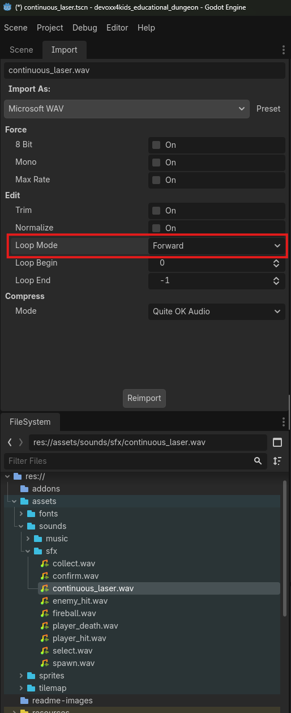

</details>

**Dans `continuous_laser.gd` :**

Ajoute la référence :

```gdscript
@onready var laser_sfx: AudioStreamPlayer = $LaserSfx
```

Dans `activate()`, ajoute à la fin :

```gdscript
	laser_sfx.play()
```

Dans `deactivate()`, ajoute à la fin :

```gdscript
	laser_sfx.stop()
```

Lance le jeu — le laser fait maintenant du bruit tant qu'il est actif, et s'arrête dès qu'il se coupe ! 🔊

---

### Groupe - Téléportation

[Revenir aux étapes ⬆️](#étapes-de-latelier)

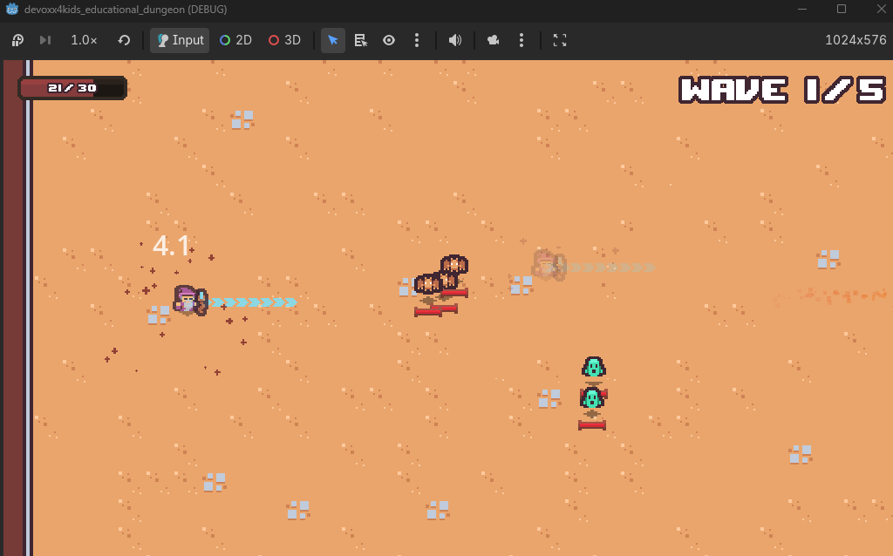

> Dans ce groupe, tu vas ajouter une capacité spéciale au sorcier : en appuyant sur **E**, il se téléporte instantanément à l'endroit où pointe ta souris ! Tu vas modifier directement le script du joueur et ajouter un temps de recharge pour équilibrer la capacité.

#### **Défi 31 — Ajoute l'action clavier**

Avant d'écrire du code, tu dois dire à Godot que la touche **E** correspond à l'action `"teleport"`.

Va dans **Project → Project Settings → Input Map**.

En haut de la liste, dans le champ **Add New Action**, tape `teleport` et clique sur **Add**.

L'action `teleport` apparaît dans la liste. Clique sur le **+** à sa droite, puis appuie sur la touche **E** du clavier → **OK**.

Ferme la fenêtre Project Settings.

> 💡 C'est comme ça que tout le jeu fonctionne : `"attack_primary"`, `"attack_secondary"`, `"move_up"` sont toutes des actions définies ici et lues dans le code avec `Input.is_action_pressed(...)`.

#### **Défi 32 — Écris le code de téléportation**

Ouvre `src/scenes/entities/player/player.gd`.

Ajoute cette fonction à la fin du fichier :

```gdscript
## Téléporte le sorcier sur la souris avec E
func _input(event: InputEvent) -> void:
	if event.is_action_pressed("teleport"): # touche E pressée ?
		global_position = get_global_mouse_position() # saute sur le curseur
```

Lance le jeu — appuie sur **E** et le sorcier saute instantanément sous le curseur de la souris ! 🌀

Réfléchis :

- Quelle est la différence entre `global_position` et `position` ?
- Que se passerait-il si tu remplaçais `is_action_pressed` par `is_action_just_pressed` ?

#### **Défi 33 — Ajoute un temps de recharge**

Pour l'instant tu peux te téléporter en boucle sans limite. Ajoutons un cooldown de **1 seconde**.

**Dans `src/scenes/entities/player/player.tscn` :**

Ouvre la scène du joueur. Dans l'arbre de scène, clic droit sur le nœud racine **Player** → **Add Child Node** → `Timer`. Renomme-le `TeleportCooldown`.

Dans l'Inspector :

- `Wait Time` : `5.0`
- `One Shot` : ✅
- `Autostart` : ❌

Sauvegarde avec **Ctrl+S**.

**Dans `player.gd` :**

Ajoute une référence au timer avec les autres `@onready` :

```gdscript
@onready var teleport_cooldown: Timer = $TeleportCooldown
```

Modifie la fonction `_input` pour vérifier le cooldown avant de se téléporter :

```gdscript
## Téléporte si le cooldown est terminé
func _input(event: InputEvent) -> void:
	if event.is_action_pressed("teleport"): # touche E pressée ?
		if teleport_cooldown.is_stopped(): # cooldown terminé ?
			global_position = get_global_mouse_position() # saute sur la souris
			teleport_cooldown.start() # démarre le cooldown
```

Lance le jeu — tu peux te téléporter une fois, puis tu dois attendre 1 seconde avant de pouvoir le refaire !

> 💡 Change la valeur `Wait Time` du timer dans l'Inspector pour ajuster la durée du cooldown. `0.5` pour être rapide, `3.0` pour rendre la capacité plus stratégique !

#### **Défi 34 — Affiche le cooldown à l'écran**

On va afficher le temps restant directement au-dessus du sorcier — comme ça, le joueur sait quand il peut se retéléporter.

**Dans `src/scenes/entities/player/player.tscn` :**

Clic droit sur le nœud racine **Player** → **Add Child Node** → `Label`. Renomme-le `TeleportLabel`.

Dans l'Inspector :

- `Position` : `x = -20, y = -50` (au-dessus du sorcier)
- `Text` : laisse vide
- `Visible` : ❌ (décoché)

**Dans `player.gd` :**

Ajoute la référence :

```gdscript
@onready var teleport_label: Label = $TeleportLabel
```

Ajoute une fonction `_process` pour mettre à jour le label chaque frame :

```gdscript
## Affiche ou cache le compte à rebours du cooldown
func _process(_delta: float) -> void:
	if teleport_cooldown.is_stopped(): # cooldown terminé ?
		teleport_label.visible = false # cache le label
	else:
		teleport_label.visible = true # affiche le label
		teleport_label.text = "%.1f" % teleport_cooldown.time_left # temps restant
```

Lance le jeu — quand tu te téléportes, un compte à rebours apparaît au-dessus du sorcier et disparaît quand la capacité est à nouveau disponible !

#### **Défi 35 — Ajoute une animation de téléportation**

On va faire disparaître le sorcier en fondu, le téléporter, puis le faire réapparaître. Pour ça on utilise un **Tween** — un outil de Godot qui anime une valeur de A vers B sur une durée donnée.

Dans `player.gd`, remplace la fonction `_input` par ceci :

```gdscript
## Déclenche la téléportation avec cooldown
func _input(event: InputEvent) -> void:
	if event.is_action_pressed("teleport"): # touche E pressée ?
		if teleport_cooldown.is_stopped(): # cooldown terminé ?
			teleport_cooldown.start() # démarre le cooldown
			_do_teleport() # lance l'animation


## Anime le fondu, téléporte, puis refait apparaître
func _do_teleport() -> void:
	var tween = create_tween() # crée un animateur
	tween.tween_property(self, "modulate:a", 0.0, 0.5) # fondu vers invisible
	await tween.finished # attend la fin du fondu

	global_position = get_global_mouse_position() # se téléporte sur la souris
	get_viewport().get_camera_2d().reset_smoothing() # recale la caméra

	tween = create_tween() # nouvel animateur
	tween.tween_property(self, "modulate:a", 1.0, 0.5) # réapparition en fondu
```

> 💡 `modulate:a` contrôle la transparence du nœud (0 = invisible, 1 = opaque). Le `await tween.finished` met la fonction en pause jusqu'à ce que le fondu soit terminé, puis la téléportation se fait, puis le sorcier réapparaît.

Lance le jeu — le sorcier s'efface doucement, disparaît, et réapparaît à l'endroit du curseur ! ✨

#### **Défi 36 — Ajoute des particules magiques**

On va déclencher une explosion de particules au point de départ **et** au point d'arrivée. Le truc clé : on va désactiver les **coordonnées locales** des particules, ce qui fait que les particules émises restent dans l'espace monde même quand le joueur se déplace.

**Dans `src/scenes/entities/player/player.tscn` :**

Clic droit sur **Player** → Add Child Node → `GPUParticles2D`. Renomme-le `TeleportParticles`.

Dans l'Inspector, configure :

- `Amount` : `20`
- `Lifetime` : `0.5`
- `One Shot` : ✅
- `Explosiveness` : `0.8` (toutes les particules partent d'un coup)
- `Emitting` : ❌
- `Local Coords` : ❌ ← **important !** les particules restent là où elles ont été émises

Clique sur **Process Material** → **New ParticleProcessMaterial**. Clique dessus pour l'ouvrir, puis configure :

- `Spread` : `180` (dans toutes les directions)
- `Initial Velocity` → `Min` : `50`, `Max` : `150`
- `Gravity` : `x = 0, y = 0`
- `Scale Min` : `0.5`, `Scale Max` : `1.5`

Pour la texture, clique sur **Texture** → glisse `assets/sprites/weapons/spark.png` depuis le FileSystem.

Pour la couleur : clique sur **Color Curves** → **New GradientTexture1D** → clique dessus → édite le gradient avec une couleur violette/magenta `(R: 180, G: 50, B: 255)` qui s'efface vers transparent.

Sauvegarde avec **Ctrl+S**.

**Dans `player.gd` :**

Ajoute la référence :

```gdscript
@onready var teleport_particles: GPUParticles2D = $TeleportParticles
```

Dans `_do_teleport()`, ajoute `teleport_particles.restart()` au départ et à l'arrivée :

```gdscript
## Anime la téléportation avec particules
func _do_teleport() -> void:
	teleport_particles.restart() # particules au point de départ
	var tween = create_tween() # crée un animateur
	tween.tween_property(self, "modulate:a", 0.0, 0.5) # fondu vers invisible
	await tween.finished # attend la fin du fondu

	global_position = get_global_mouse_position() # se téléporte sur la souris
	get_viewport().get_camera_2d().reset_smoothing() # recale la caméra

	teleport_particles.restart() # particules au point d'arrivée
	tween = create_tween() # nouvel animateur
	tween.tween_property(self, "modulate:a", 1.0, 0.5) # réapparition en fondu
```

Lance le jeu — une gerbe de particules violettes explose au point de départ, puis une autre apparaît là où le sorcier réapparaît ! 🪄

---

### Groupe - Tempête Électrique

[Revenir aux étapes ⬆️](#étapes-de-latelier)

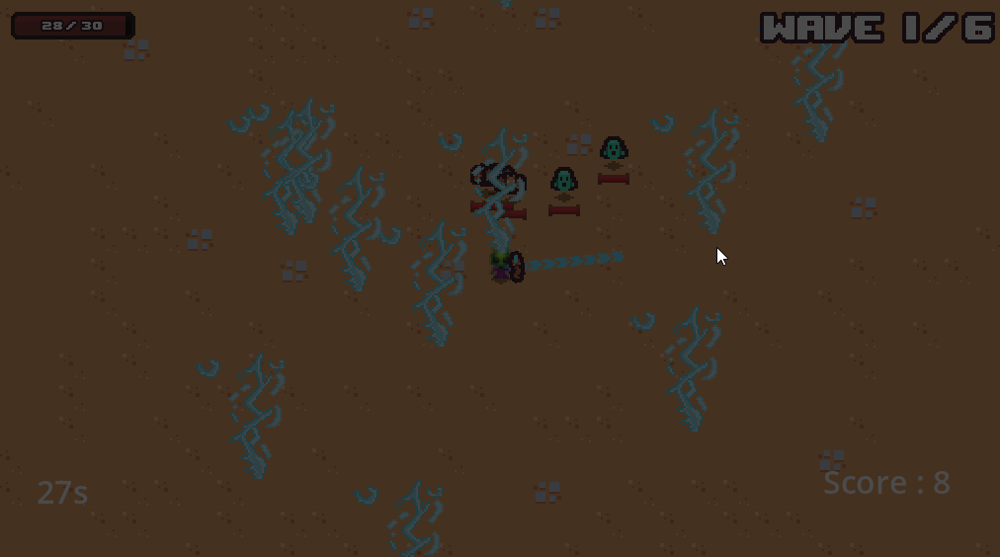

> Dans ce groupe, tu vas transformer la vague 6 en une vraie tempête électrique ! L'arène s'assombrira, des éclairs illumineront le ciel, et des zones de foudre mortelles apparaîtront au sol. Si le sorcier marche dessus au mauvais moment… il perd de la vie !

#### **Défi 37 — Crée le gestionnaire de tempête**

Ouvre la scène `src/scenes/game/wave_manager/game.tscn`. Dans l'arbre de scène, fais un **clic droit sur le nœud racine** et choisis **Add Child Node**.

Cherche **`CanvasLayer`** et clique **Create**. Renomme-le `Storm`.

Dans l'**Inspector**, règle la propriété **`Layer`** à `100` (pour s'afficher par-dessus tout le jeu).

Maintenant, ajoute deux nœuds enfants à `Storm` :

**L'assombrissement :**

- Clic droit sur `Storm` → Add Child Node → **`ColorRect`**, renomme-le `DarkOverlay`
- Dans l'Inspector, clique sur **`Layout`** → **`Full Rect`** (pour couvrir tout l'écran)
- Change la couleur : `(R: 0, G: 0, B: 0, A: 180)` — noir semi-transparent
- Décoche **`Visible`** ❌

**Le flash d'éclair :**

- Clic droit sur `Storm` → Add Child Node → **`ColorRect`**, renomme-le `FlashOverlay`
- Dans l'Inspector, clique sur **`Layout`** → **`Full Rect`**
- Change la couleur : `(R: 140, G: 195, B: 255, A: 11)` — blanc presque opaque
- Décoche **`Visible`** ❌

**Le timer des flashs :**

- Clic droit sur `Storm` → Add Child Node → **`Timer`**, renomme-le `FlashTimer`
- `One Shot` : ✅, `Autostart` : ❌

Fais un **clic droit sur `Storm`** → **Attach Script**. Nomme-le `storm.gd` et place-le dans `src/scenes/game/wave_manager/`. Clique **Create**.

Sauvegarde avec **Ctrl+S**.

#### **Défi 38 — Assombris l'arène pendant la vague 6**

Ouvre `storm.gd` et remplace son contenu par ce code :

> Trouves le numéro de la vague dans le code, pour le remplacer par 1 comme ça tu pourras tester plus facilement !

```gdscript
## Gère les effets visuels de la tempête électrique en vague 6
extends CanvasLayer

@onready var dark_overlay: ColorRect = $DarkOverlay # le voile sombre
@onready var flash_overlay: ColorRect = $FlashOverlay # l'éclair blanc
@onready var flash_timer: Timer = $FlashTimer # le timer entre deux éclairs


func _ready() -> void:
	Signals.wave_started.connect(_on_wave_started) # écoute le signal de début de vague
	flash_timer.timeout.connect(_on_flash_timer_timeout) # écoute la fin du timer


## Déclenche la tempête quand la vague 6 commence
func _on_wave_started(wave_number: int) -> void:
	if wave_number == 6: # seulement en vague 6 ?
		dark_overlay.visible = true # assombrit l'arène
		_programmer_prochain_eclair() # lance le premier éclair


## Programme le prochain flash dans un délai aléatoire de 5 à 15 secondes
func _programmer_prochain_eclair() -> void:
	flash_timer.wait_time = randf_range(3.0, 10.0) # durée aléatoire
	flash_timer.start() # démarre le timer


## Quand le timer se termine : fait clignoter l'écran
func _on_flash_timer_timeout() -> void:
	flash_overlay.visible = true # flash blanc !
	await get_tree().create_timer(0.12).timeout # attend 0.12 secondes
	flash_overlay.visible = false # éteint le flash
	_programmer_prochain_eclair() # prépare le prochain
```

Lance le jeu et survie jusqu'à la vague 6 — l'arène devient sombre et des éclairs illuminent l'écran ! ⚡

> 💡 **`randf_range(3.0, 10.0)`** génère un nombre décimal aléatoire entre 5 et 15. **`await`** met le code en pause jusqu'à ce que le timer soit terminé, comme dans la téléportation.

<details>
<summary>Solution</summary>

L'arbre de scène de `Storm` devrait ressembler à ceci :

```
Storm (CanvasLayer, layer = 100)
├── DarkOverlay (ColorRect, noir semi-transparent, visible = false)
├── FlashOverlay (ColorRect, blanc, visible = false)
└── FlashTimer (Timer, one_shot = true)
```

</details>

---

#### **Défi 39 — Crée la scène d'une zone de foudre**

Tu vas créer une nouvelle scène pour les zones de foudre au sol — ces **ronds jaunes qui clignotent** pour avertir le joueur avant que la foudre tombe ! Ils utilisent la même animation que les cercles qui apparaissent avant les ennemis.

Dans le **FileSystem**, fais un clic droit sur le dossier `src/scenes/game/wave_manager/` → **New Scene**.

Dans l'arbre de scène vide, clique sur **Other Node** → cherche **`Node2D`** → **Create**. Renomme-le `LightningStrike`.

Ajoute les nœuds enfants suivants à `LightningStrike` :

**La zone d'avertissement :**

- Add Child Node → **`Sprite2D`**, renomme-le `Warning`
- Dans l'Inspector, clique sur le champ **`Texture`** → **Quick Load** → choisis **`target.png`**
- Change **`Modulate`** : `(R: 238, G: 216, B: 0, A: 255)` — bleu électrique

**L'animation d'éclair à l'impact :**

- Add Child Node → **`AnimatedSprite2D`**, renomme-le `Strike`
- Dans l'Inspector, clique sur **`Sprite Frames`** → **New SpriteFrames**
- Double-clique sur la ressource **SpriteFrames** qui vient d'apparaître — le panneau SpriteFrames s'ouvre en bas de l'écran
- Clique sur **Add frames from sprite sheet** (l'icône grille avec un +)
- Sélectionne **`assets/sprites/misc/thunder.png`**
- Dans la fenêtre qui s'ouvre, règle la grille : **`Horizontal` = 4**, **`Vertical` = 1**
- Sélectionne les 4 frames (Ctrl+A), puis clique **Add X frames**
- De retour dans l'Inspector, règle **`FPS`** à `30` (30 images par seconde)
- Décoche **`Visible`** ❌
- Vérifies bien que l'icone `Animation Looping` est désactivé ! [Animation Looping](./readme-images/challenges-lightning-animation-looping.png)

**Le timer avant l'impact (3 secondes d'avertissement) :**

- Add Child Node → **`Timer`**, renomme-le `StrikeTimer`
- `Wait Time` : `3.0`, `One Shot` : ✅, `Autostart` : ✅

Fais un **clic droit sur `LightningStrike`** → **Attach Script** → nomme-le `lightning_strike.gd`, dans `src/scenes/game/wave_manager/`. Clique **Create**.

Sauvegarde la scène avec **Ctrl+S** sous le nom `lightning_strike.tscn` dans `src/scenes/game/wave_manager/`.

Maintenant, ouvre `lightning_strike.gd` et écris ce code :

```gdscript
## Un éclair qui tombe sur une zone : rond jaune clignotant, puis impact d'éclair animé
extends Node2D

@onready var warning: Sprite2D = $Warning # le rond jaune d'avertissement
@onready var strike: AnimatedSprite2D = $Strike # l'animation d'éclair
@onready var strike_timer: Timer = $StrikeTimer # le timer de 3 secondes


func _ready() -> void:
	strike_timer.timeout.connect(_on_strike_timer_timeout) # écoute la fin du timer
	_pulse_warning() # lance l'animation de clignotement


## Fait pulser le rond en boucle (même animation que l'apparition des ennemis !)
func _pulse_warning() -> void:
	var tween = create_tween().set_loops() # boucle infinie
	tween.tween_property(warning, "scale", Vector2(1.2, 1.0), 0.35) # grossit
	tween.parallel().tween_property(warning, "modulate", Color(1, 0.451, 0.224, 1), 0.35) # devient orange
	tween.tween_property(warning, "scale", Vector2(0.85, 0.75), 0.35) # rétrécit
	tween.parallel().tween_property(warning, "modulate", Color(1, 0.933, 0.271, 1), 0.35) # revient jaune


## Quand les 3 secondes sont écoulées : déclenche l'impact !
func _on_strike_timer_timeout() -> void:
	warning.visible = false # cache l'avertissement
	strike.visible = true # montre l'éclair
	strike.play("default") # joue l'animation
	_infliger_degats() # vérifie si le joueur est là
	await strike.animation_finished # attend la fin de l'animation
	queue_free() # supprime cette zone


## Vérifie si le joueur est sur la zone, et lui inflige des dégâts
func _infliger_degats() -> void:
	var player = GameData.player
	if player == null: # pas de joueur ?
		return
	var distance = global_position.distance_to(player.global_position)
	if distance < 24: # le joueur est dans la zone ?
		var dmg = DamageInformation.new() # crée un objet de dégâts
		dmg.damage = 1 # 1 point de dégât
		player.player_health.hurt_box.hurt.emit(dmg) # inflige les dégâts !
```

> 💡 **`strike.play("default")`** lance l'animation. **`await strike.animation_finished`** attend que les 4 frames soient jouées avant de supprimer la zone. Sprite par [Gutima15](https://opengameart.org/content/thunder-sprite) (CC-BY 4.0).

<details>
<summary>Solution</summary>

L'arbre de scène de `LightningStrike` devrait ressembler à ceci :

```
LightningStrike (Node2D)
├── Warning (Sprite2D, texture = target.png, modulate = jaune, visible = true)
├── Strike (AnimatedSprite2D, SpriteFrames = thunder.png 4 frames, visible = false)
└── StrikeTimer (Timer, wait_time = 3.0, one_shot = true, autostart = true)
```

</details>

---

#### **Défi 40 — Fais apparaître les zones de foudre pendant la vague 6**

Maintenant on va faire spawner entre 30 et 70 zones de foudre aléatoirement dans l'arène, régulièrement pendant la vague 6.

Retourne dans `storm.gd`. Ajoute un nouveau **Timer** à la scène `Storm` :

Dans `game.tscn`, sélectionne le nœud `Storm` → Add Child Node → **`Timer`**, renomme-le `LightningSpawnTimer`.

Dans l'Inspector : `Wait Time` : `4.0`, `One Shot` : ❌, `Autostart` : ❌

Sauvegarde avec **Ctrl+S**.

Maintenant, mets à jour `storm.gd` pour ajouter la logique de spawn :

```gdscript
## Gère les effets visuels de la tempête électrique en vague 6
extends CanvasLayer

@export var lightning_strike_scene: PackedScene # la scène de zone de foudre

@onready var dark_overlay: ColorRect = $DarkOverlay # le voile sombre
@onready var flash_overlay: ColorRect = $FlashOverlay # l'éclair blanc
@onready var flash_timer: Timer = $FlashTimer # le timer entre deux éclairs
@onready var lightning_spawn_timer: Timer = $LightningSpawnTimer # le timer de spawn


func _ready() -> void:
	Signals.wave_started.connect(_on_wave_started) # écoute le signal de début de vague
	flash_timer.timeout.connect(_on_flash_timer_timeout) # écoute la fin du timer
	lightning_spawn_timer.timeout.connect(_on_lightning_spawn_timer_timeout)


## Déclenche la tempête quand la vague 6 commence
func _on_wave_started(wave_number: int) -> void:
	if wave_number == 6: # seulement en vague 6 ?
		dark_overlay.visible = true # assombrit l'arène
		_programmer_prochain_eclair() # lance le premier éclair
		lightning_spawn_timer.start() # commence à faire apparaître les zones


## Programme le prochain flash dans un délai aléatoire de 5 à 15 secondes
func _programmer_prochain_eclair() -> void:
	flash_timer.wait_time = randf_range(3.0, 10.0) # durée aléatoire
	flash_timer.start() # démarre le timer


## Quand le timer se termine : fait clignoter l'écran
func _on_flash_timer_timeout() -> void:
	flash_overlay.visible = true # flash blanc !
	await get_tree().create_timer(0.12).timeout # attend 0.12 secondes
	flash_overlay.visible = false # éteint le flash
	_programmer_prochain_eclair() # prépare le prochain


## Fait apparaître entre 30 et 70 zones de foudre dans l'arène
func _on_lightning_spawn_timer_timeout() -> void:
	var nombre = randi_range(30, 70) # combien d'éclairs ce tour-ci ?
	for i in nombre: # répète "nombre" fois
		_spawn_un_eclair()


## Place une zone de foudre à une position aléatoire dans la zone de jeu
func _spawn_un_eclair() -> void:
	if lightning_strike_scene == null: # la scène est-elle assignée ?
		return
	var zone = GameData.spawn_area # la zone où les ennemis apparaissent
	var pos = Vector2(
		randf_range(zone.position.x, zone.end.x), # x aléatoire dans la zone
		randf_range(zone.position.y, zone.end.y)  # y aléatoire dans la zone
	)
	var strike = lightning_strike_scene.instantiate() # crée une zone de foudre
	strike.global_position = pos # place-la dans le monde
	GameData.game_root.add_child(strike) # ajoute-la à la scène principale
```

Maintenant, dans l'Inspector du nœud `Storm` (dans `game.tscn`), tu dois voir la propriété **`Lightning Strike Scene`**.

Glisse le fichier `lightning_strike.tscn` depuis le FileSystem vers cette propriété.

Lance le jeu et survie jusqu'à la vague 6 — des ronds jaunes clignotants apparaissent aléatoirement dans l'arène, puis des éclairs s'abattent ! ⚡

> 💡 **`randi_range(0, 10)`** génère un entier aléatoire entre 0 et 10. **`instantiate()`** crée une copie d'une scène dans le jeu — comme les ennemis qui apparaissent depuis leurs scènes !

<details>
<summary>Solution</summary>

Dans l'Inspector du nœud `Storm`, la propriété `Lightning Strike Scene` doit pointer vers `res://src/scenes/game/wave_manager/lightning_strike.tscn`.

</details>

---

### Upload ton Projet

[Revenir aux étapes ⬆️](#étapes-de-latelier)

1. Ouvres le dossier windows à l'emplacement suivant: `C:\workspace\atelier-jeu-video`
2. double clic sur le fichie `save.bat`, entre un nom de sauvegarde et lorsque ça t'est demandé, choisis ZIP.
3. Après compression, tu trouveras ton projet compressé au format ZIP dans ton projet du jeux vidéo.
4. Clique sur [ce lien pour ouvrir directement le dossier Google Drive](https://drive.google.com/drive/folders/1Nno74QtZJMh8ZiMtmIGogpXdfisY1pnj) dans un navigateur internet.
5. Si ce n'est pas déjà fait, connectes toi avec le compte `lab.devoxx4kidsqc@gmail.com` - demande nous le mot de passe.
6. Glisse ton fichier `******.zip` dans le navigateur pour uploader ton fichier sur notre Google Drive.
7. Demandes un QR code papier aux instructeurs qui contient le lien vers notre page [https://linktr.ee/devoxx4kids_montreal](https://linktr.ee/devoxx4kids_montreal)
8. Une fois chez toi, rends toi à cette adresse avec un navigateur internet, descend jusqu'àu bouton avec l'icone de Godot qui pointe vers le dossier Google Drive avec ton jeu.
9. Tu n'as pas besoin de te reconnecter au compte, le dossier est public pour le téléchargement, tu peux même partager le QR code à tes amis si tu veux !

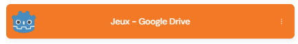

---

### Présente ton jeu

[Revenir aux étapes ⬆️](#étapes-de-latelier)

Tu as terminé tes défis ? **Bravo !** 🎉

Il est temps de présenter ton travail à tes parents. Explique-leur :

- Quels sont les grands moteurs de jeu dans l'industrie ?
  - Réponse: Unity, Unreal Engine, Godot
- C'est quoi un jeu Open Source ?
  - Réponse: c'est un jeu dont le code source est public : n'importe qui peut le lire, l'utiliser, le modifier et le partager.
- C'est quoi Godot et GDScript ?
  - Réponse: C'est un moteur de jeu vidéo gratuit et Open Source.
  - Réponse: GDScript est le langage de programmation principal de Godot. Inspiré de Python.
- Qu'est-ce que tu as modifié dans le jeu ?
  - Réponse:
  - Groupe 1: La vitesse du sorcier, devenir invincible, réduire la vie des ennemis, des millions d'ennemis
  - Groupe 2: Tirer comme une mitrailleuse, doubler les dégâts, changer la formation d'apparition, changer les vagues
  - Groupe 3: Doubler la vitesse du joueur, accélérer la boule de feu, réparer la visée avec la souris, ajouter une variable de score, découvrir les signaux
  - Groupe 4: Réparer la visée de la souris, augmenter le score à chaque kill, afficher le score à l'écran, créer une nouvelle vague
  - Groupe 5: Trouver un sprite open source, l'importer dans Godot, remplacer l'apparence du sorcier
  - Groupe 6: Ajouter des murs dans l'arène, avec collisions et visuel
  - Groupe 7: Changer la couleur des boules de feu et des explosions, compter le temps de survie, l'afficher à l'écran
  - Groupe 8: Créer un rayon laser continu avec RayCast2D, dégâts au fil du temps, désactivation automatique à la mort d'un ennemi
  - Groupe 9: Ajouter la téléportation sur la souris avec la touche E, temps de recharge
  - Groupe 10: Transformer la vague 6 en tempête électrique : écran sombre, flashs d'éclair, zones de foudre mortelles
- Quel défi était le plus difficile ? Pourquoi ?
- Tu as personnalisé le jeu ? Comment ?

---

## Installation à la maison

[Revenir aux étapes ⬆️](#étapes-de-latelier)

Tu veux continuer à modifier le jeu chez toi ? Suis ces étapes !

### Étape 1 — Installe Godot Engine

1. Va sur [https://godotengine.org/download](https://godotengine.org/download)
2. Télécharge la version **Godot Engine 4** (Standard, pas .NET)
3. C'est un fichier `.zip` — extrait-le et lance l'exécutable `Godot_v4.x.x...exe`
4. Pas besoin d'installation : Godot fonctionne directement !

### Étape 2 — Télécharge le projet

**Option A — Après l'atelier**

1. Clique sur ce lien pour ouvrir le Google Drive dans lequel tu as uploadé ton projet
2. Télécharges ton projet que tu avais compressé au format `.zip`
3. Choisis un dossier sur ton ordinateur oú extraire ton projet. Par exemple `C:\workspace\\`
4. Places ton fichier `.zip` dans ce dossier
5. Fais un `Clic-Droit` sur ce fichier, et sélectionne `Tout Extraire`
6. Une fenêtre s'ouvre, valide l'extraction en cliquant sur `Extraire`

Ton projet est maintenant prêt à être ouvert une fois que tu auras ouvert Godot. Passe maintenant à [l'Étape 3](#étape-3---ouvre-le-projet)

**Option B - Téléchargement direct du projet de démarrage **

1. Va sur la page du projet : `[URL_DU_PROJET_GITHUB]`
2. Clique sur le bouton vert **`< > Code`** puis sur **Download ZIP**
3. Extrais le fichier ZIP sur ton bureau

**Option C - Avec Git (pour les curieux)**
Si tu as [Git](https://git-scm.com/downloads) installé, ouvre un terminal et tape :

```bash
git clone [URL_DU_PROJET_GITHUB]
```

> 💡 **C'est quoi Git ?** C'est un outil qui permet de sauvegarder l'historique de toutes les modifications d'un projet. C'est ce que tous les développeurs professionnels utilisent !

### Étape 3 - Ouvre le Projet

1. Lance **Godot Engine**
2. Dans le **Project Manager**, clique sur **Import**
3. Navigue jusqu'au dossier du projet et sélectionne `project.godot`
4. Clique sur **Import & Edit**
5. Appuie sur **F5** pour jouer !

### Étape 4 - Continue tes défis !

Reprends là où tu t'étais arrêté pendant l'atelier. Tu peux aussi inventer tes propres améliorations !

---

## Pour aller plus loin

[Revenir aux étapes ⬆️](#étapes-de-latelier)

### Godot & GDScript

- 📖 [Documentation officielle de Godot](https://docs.godotengine.org/fr/stable/)
- 📖 [Bases de GDScript](https://docs.godotengine.org/fr/stable/tutorials/scripting/gdscript/gdscript_basics.html)
- 🎓 [Ton premier jeu avec Godot (tutoriel officiel)](https://docs.godotengine.org/fr/stable/getting_started/first_2d_game/index.html)
- 🎥 [GDQuest — Tutoriels Godot (YouTube)](https://www.youtube.com/@Gdquest)

### Open Source & Programmation

- 🌍 [Devoxx4Kids](https://www.devoxx4kids.org/) — L'organisation qui organise ces ateliers
- 💻 [GitHub](https://github.com) — Le site où les développeurs partagent leur code Open Source
- 🐍 [Learn Python](https://www.learnpython.org/) — Pour apprendre Python, un langage similaire à GDScript

---

## Erreurs et Diagnostiques

Si tu as une erreur que tu n'arrives pas à résoudre, c'est aussi normal en programmation !
Les programmeurs travaillent sur des machines différentes qui sont toutes configurées différement, mais surtout les versions des languages et logiciels changent très souvent ! Les programmeurs sont des gros travailleurs 🧑‍💻
Voici celles qui nous ont posé problème à nous aussi et dont nous avons trouvé la solution.

### Panique à bord, le projet ne fonctionne plus

Tu as modifié beaucoup de choses et le projet ne fonctionne plus ? Ne panique pas, tu peux simplement le re-télécharger et le réouvrir tout neuf !

- Si tu sais déjà utiliser GIT, alors à la racine de ton projet utilises la commande `git restore`
- Si tu préfères, tu peux le toujours télécharger ici.
  - Télécharges le fichier ZIP ici [atelier-jeu-video](https://github.com/montrealjug/atelier-jeu-video/archive/refs/heads/main.zip)
  - C'est une archive, il faut que tu extraie les fichier à l'intérieur. Tu peux double cliquer dessus et copier-coller les fichiers dans le dossier que tu préfères sur ton ordinateur
  - Assures toi que Godot est bien fermé
  - Remplace les fichiers de ton ancien projet par les nouveaux
  - Relance l'application Godot et si besoin réimporte ton projet

### Godot Version / Imports

#### Error related to Godot Version


#### Solution

1. Télécharges la dernière version de Godot ici: [Download](https://godotengine.org/download)
2. Extrait le contenu de l'archive zip à un endroit que tu préfères sur ton ordinateur, par exemple ici `C:\Program Files\Godot`
3. Ton dossier Godot devrait maintenant contenir deux fichiers, comme ci-dessous:

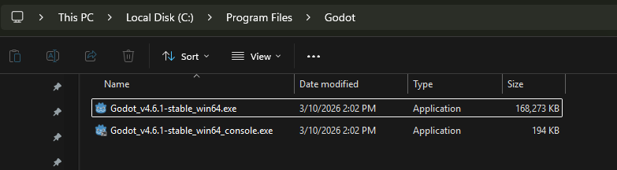

4. Créer toi un raccourci du fichier `Godot_v4.6.1-stable_win64.exe` en faisant un clic droit dessus. Tu peux mettre ton raccourcis sur le bureau, dans la barre des tâches, ou oú tu préfères.
5. Lance Godot à partir de ton nouveau raccourcis.
6. S'il ne détecte pas le projet du jeu automatiquement, importe le ici en cliquant sur `importer`. S'il est déjà listé, tu peux le lancer en cliquant directement dessus.

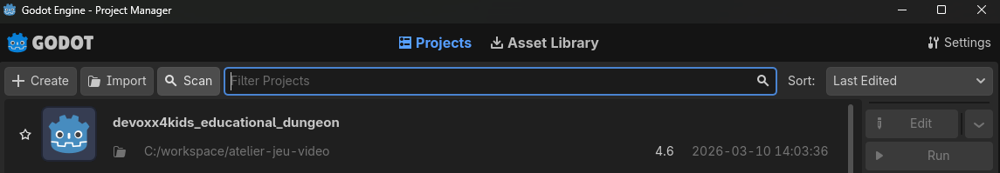

### Toujours bloqué ?

## Contacte nous ici ([Contact](#-ouvrir-le-projet-dans-godot)), on sera contents de t'aider !

_Fait avec ❤️ pour Devoxx4Kids Québec — Inspirons la prochaine génération de développeurs de jeux !_

## Contacts

Concepteur de l'atelier: [Romain Dalichamp](https://linkfr.ee/romain.dalichamp)
Créateur du jeu & Développeur: [Florian Rea](https://www.linkedin.com/in/florian-rea-57a7bb107)
Animateur de l'atelier: [Anthony Dahanne](https://www.linkedin.com/in/anthonydahanne)

## Commandes pour l'atelier

Quelques commandes pour reset un projet correctement

- Chaque enfant doit commencer à travailler sur la branche locale `workshop`
- Les enfants ne poussent pas sur la branche `workshop`, c'est juste pour éviter de travailler sur la branche `main`
- `main` = `workshop`
- Caque branche a du code compatible avec les autres branches.
- Dans la branche workshop, on peut facilement faire un `git merge branche1 branche2 branche3` pour récupérer les solutions du groupe désiré
- la branche `solutions`, contient toutes les solutions déjà mergée, avec des tags

<details>
<summary>Solution</summary>

```
git checkout main-with-solutions
git reset --hard origin/workshop
git merge challenges-group-fix-mouse-aiming challenges-group-score

git merge fix-default-weapon-direction challenges-group-score challenges-group-one-more-wave challenges-group-teleportation challenges-group-artist-pixel-art challenges-group-fix-mouse-aiming challenges-group-architect  challenges-group-continuous-laser-beam challenges-group-creative-coder challenges-group-lightning
```

</details>
